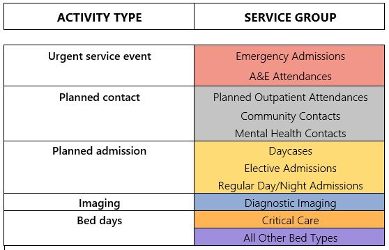

```{r setup, include = FALSE}
knitr::opts_chunk$set(echo = FALSE, 
                      message = FALSE, 
                      warning = FALSE)

#knitr::opts_chunk$set(fig.cap = "", fig.path = "Plot")

library(readxl)
library(dplyr)
library(tidyverse)
library(ggplot2)
library(reshape2)
library(rlang)
library(formattable)
library(scales)
library(xlsx)
#library(here)
library(StrategyUnitTheme)
#library(gt) #https://towardsdatascience.com/top-7-packages-for-making-beautiful-tables-in-r-7683d054e541
library(flextable)

```

```{r}
#| label: get-data
MPI_MIDS <- read_csv('Inputs/MPI.csv') %>% 
  filter(ICB_Code_Registration %in%
           c('QT1','QK1','QK1','QK1','QJM','QT1','QJ2','QPM','QNC','QNC','QNC','QNC','QNC','QNC','QGH','QWU','QOC','QHL','QUA')) %>% 
  mutate(LocationType = case_when(LocationType == 'Elsewhere/Other' ~ 'Other',
                                  TRUE ~ LocationType),
         EthnicGroup = case_when(EthnicGroup == 'Asian or Asian British' ~ 'Asian/Asian British',
                                 EthnicGroup == 'Black or Black British' ~ 'Black/Black British',
                                 EthnicGroup == 'Other Ethnic Groups' ~ 'Other',
                                 TRUE ~ EthnicGroup))

Activity_MIDS <- read_csv('Inputs/Activity.csv') %>% 
  filter(ICB_Code_Registration %in% c('QT1','QK1','QK1','QK1','QJM','QT1','QJ2','QPM','QNC','QNC','QNC','QNC','QNC','QNC','QGH','QWU','QOC','QHL', 'QUA')) %>% 
  mutate(PODSummaryGroupUpdated = 
           case_when(PODSummaryGroup == 'EM' & 
                       PODTypeUpdated == 'Critical Care Bed Day' ~ 'Critical Care as Emergency',
                     PODSummaryGroup == 'EL' & 
                       PODTypeUpdated == 'Critical Care Bed Day' ~ 'Critical Care as Elective',
                     PODSummaryGroup == 'AE' ~ 'A&E Att.',
                     PODSummaryGroup == 'EM' &  PODType != 'BED' ~ 'Emergency Adm.',
                     PODSummaryGroup == 'OP' ~ 'Outpatient Att.',
                     PODSummaryGroup == 'COM' ~ 'Community Cont.',
                     PODSummaryGroup == 'MH' ~ 'Mental Health Cont.',
                     PODSummaryGroup == 'DC' ~ 'Daycase Adm.',
                     PODSummaryGroup == 'EL' &  PODType != 'BED' ~ 'Elective Adm.',
                     PODSummaryGroup == 'RA' ~ 'Regular Adm.',
                     PODSummaryGroup == 'AE' ~ 'A&E Att.',
                     PODSummaryGroup == 'EM' &  PODType == 'BED' ~ 'Bed Day as Emergency',
                     PODSummaryGroup == 'EL' &  PODType == 'BED' ~ 'Bed Day as Elective',
                     PODTypeUpdated == 'Imaging' ~ 'Imaging'), #or should be blanks still?
         PODTypeUpdated = case_when(PODType == 'BED' ~ 'Bed Day',
                                    PODType == 'PlannedEvent' ~ 'Planned Admission',
                                    TRUE ~ PODTypeUpdated))

PplICB     <- nrow(MPI_MIDS %>%
                     filter(MPI_MIDS$ICB_Code_Registration == params$ICB))
PplICBResp <- nrow(MPI_MIDS %>%
                     filter(MPI_MIDS$ICB_Code_Registration == params$ICB & MPI_MIDS$RespPatient == 1))
PplICBRespCOPD <- nrow(MPI_MIDS %>%
                         filter(ICB_Code_Registration == params$ICB &
                                  RespPatient == 1 & 
                                  RespGroup == 'COPD'))
PplICBRespILD <- nrow(MPI_MIDS %>%
                         filter(ICB_Code_Registration == params$ICB &
                                  RespPatient == 1 & 
                                  RespGroup == 'ILD'))
PplMID     <- nrow(MPI_MIDS)
PplMIDResp <- nrow(MPI_MIDS %>%
                     filter(MPI_MIDS$RespPatient == 1))
PplMIDRespCOPD <- nrow(MPI_MIDS %>%
                         filter(RespPatient == 1 & 
                                RespGroup == 'COPD'))
PplMIDRespILD <- nrow(MPI_MIDS %>%
                         filter(RespPatient == 1 & 
                                RespGroup == 'ILD'))

PplICBRespILD85 <- nrow(MPI_MIDS %>%
                          filter(ICB_Code_Registration == params$ICB &
                                 RespPatient == 1 & 
                                 RespGroup == 'ILD' &
                                 AgeGroup == '85+'))

LkupICB <- read_xlsx('Inputs/ICBNamesandCodes.xlsx')
ICBName <- as.character(unique(MPI_MIDS %>% left_join(LkupICB, by = c('ICB_Code_Registration' = 'ICB22')) %>% 
  filter(ICB_Code_Registration == params$ICB) %>% 
    select(TidyName)))

temp <- case_when(PplICBRespCOPD/PplICBResp>0.3 ~ 'a third', 
          TRUE ~ 'a quarter')

```

# Introduction

For `r ICBName` there were `r format(PplICB, big.mark = ',')` adult deaths in the year 2022. Of these, `r PplICBResp` (`r percent(PplICBResp/PplICB)`) were chronic lung disease patients. This is similar to the Midlands region as a whole – the region encompasses 11 Integrated Care Boards - where chronic lung disease deaths were also `r percent(PplMIDResp/PplMID)` of all adult decedents.

The classification of a decedent as being a chronic lung disease death was based on the underlying cause of death as recorded on the death record. All adult deaths with an underlying cause related to Diseases of the Respiratory System, as defined by the International Statistical Classification of Diseases and Related Health Problems, were reviewed. This review took place with a clinician working in respiratory palliative care. From this review came the methodology we use here to identify and classify chronic lung disease deaths. Outputs from the review are included in      Appendix A.

The analysis presented here is based on linking different datasets. These datasets cover hospital care, community contacts, and mental health contacts. Decedents are drawn from the national register of all adults who died in `r ICBName` ICB in 2022. Each deceased person is linked to their service use in the two-year period prior to their death. For reasons of availability, it excludes data on social care, GP practices, and ambulance services.

The deaths used in this analysis are at a point in time (2022) when the COVID-19 pandemic was largely viewed as being in the past and all legal limits on social contact had been lifted. However, although people may not have been affected by the pandemic when they died in 2022, during the two years prior to death their healthcare use may have taken place at a time when the pandemic did affect access to, and use of, healthcare. 

This work was funded via a programme of analytical support for West Midlands Acute Providers (WMAP). The Strategy Unit began this work with an initial ‘problem formulation’ session – essentially, a process to establish with lead clinicians, and other relevant staff working in respiratory services,  what critical questions respiratory services are facing and what analysis would be most helpful to future service improvements. At this session there was a clear interest in respiratory patients dying from chronic lung disease. Interest was centered around understanding the circumstances of their death and their use of services in the time prior to death. Therefore, in this report we provide insight for `r ICBName` ICB into who their end-of-life chronic lung disease patients are, their healthcare use prior to death and comparisons to the wider Midlands region.

\pagebreak

# Who are chronic lung disease end-of-life patients?

## Age

Of the `r format(PplICBResp, big.mark = ',')` deceased chronic lung disease patients in `r ICBName`, 
close to `r  case_when(PplICBRespCOPD/PplICBResp>0.3 ~ 'a third', TRUE ~ 'a quarter')` died with the underlying cause of Interstitial Lung Disease (ILD). The remaining `r case_when(PplICBRespCOPD/PplICBResp>0.3 ~ 'two-thirds', TRUE ~ 'threequarters')` were deaths with an underlying cause of Chronic Obstructive Pulmonary Disease (COPD). 

The age profile among chronic lung disease decedents differs by disease group. Interstitial Lung Disease decedents have an older profile, close to a third are aged 85 and older. For Chronic Obstructive Pulmonary Disease, only a quarter are in this oldest age group. There are proportionallymore Chronic Obstructive Pulmonary Disease decedents in the youngest age groups (particularly aged 65-74) than in Interstitial Lung Disease. 

Disease group and age profiles are similar to those seen in the Midlands.

*Figure 1: Proportion of chronic lung disease decedents by disease and age group - `r ICBName` ICB*

```{r, fig.width = 6, fig.height = 2.8, dpi = 300}
#| label: mekko-agegroup-cause

mekko.c <- MPI_MIDS %>%
  filter(ICB_Code_Registration == params$ICB & MPI_MIDS$RespPatient == 1) %>% 
  mutate(RespGroup = fct_relevel(RespGroup, c('ILD', 'COPD')),
         AgeGroup = fct_relevel(AgeGroup, c('85+','75-84','65-74','18-65'))) %>% 
  count(RespGroup, AgeGroup)

mekko.x <- mekko.c %>%
  group_by(RespGroup) %>%
  summarise_at(vars(n), sum) %>%
  mutate_at(vars(n), ~.x / sum(.x)) %>%
  mutate(xmax = cumsum(n),
         xmin = lag(xmax, 1, 0)) %>%
  select(-n)

mekko.y <- mekko.x %>%
  inner_join(mekko.c, by = 'RespGroup', multiple = 'all') %>%
  group_by(RespGroup) %>%
  mutate(AgeGroup = case_when(AgeGroup == '85+' ~ paste0('            ',AgeGroup),
                              TRUE ~ paste0('          ',AgeGroup))) %>% 
  mutate_at(vars(n), ~.x / sum(.x)) %>%
  mutate(ymax = cumsum(n),
         ymin = lag(ymax, 1, 0)) %>%
  select(RespGroup, AgeGroup, xmin, xmax, ymin, ymax) %>%
  mutate(lab_x = (xmin + xmax) / 2,
         lab_y = (ymin + ymax) / 2,
         lab_v = ifelse(#show_labels = TRUE &
                          ymax-ymin > 0.05 &
                          xmax-xmin > 0.05,
                        percent(ymax-ymin, accuracy = 1),
                        NA))

y_labs <- mekko.y %>%
  filter(xmin == 0) %>%
  mutate(y = (ymax + ymin) / 2)

x_labels <- pull(mekko.x, RespGroup)

x_breaks <- (pull(mekko.x, xmax) + pull(mekko.x, xmin)) / 2

mekko.y %>%
  ggplot(aes(xmin = xmin, xmax = xmax, ymin = ymin, ymax = ymax,
             fill = AgeGroup)) +
  su_theme() +
  geom_rect(colour = 'white') +
  scale_fill_manual(values = su_theme_cols('orange', 'blue', 'charcoal', 'red'#, 'slate'
                                           ) %>% 
                      set_names(c('            85+',
                                  '          75-84', 
                                  '          65-74',
                                  '          18-64'))) +
  geom_text(aes(x = lab_x, y = lab_y, label = lab_v),
            colour = 'white',
            na.rm = TRUE) +
  scale_x_continuous(breaks = x_breaks,
                     labels = x_labels,
                     sec.axis = dup_axis(breaks = seq(0,1,.2),
                     labels = percent_format(accuracy = 1)),
                     expand = c(0, 0)) +
  scale_y_continuous(breaks = pull(y_labs, y),
                     labels = pull(y_labs, AgeGroup),
                     sec.axis = dup_axis(breaks = seq(0,.9,.2),
                     labels = percent_format(accuracy = 1)),
                     expand = c(0, 0)) +
  labs(x = '', y = '') +
  theme(legend.position = 'none',
        axis.line = element_blank(),
        axis.ticks = element_blank()) 
```

\pagebreak

*Figure 2: Proportion of chronic lung disease decedents by disease and age group - Midlands region*

```{r, fig.width = 6, fig.height = 2.8, dpi = 300}
#| label: mekko-agegroup-cause-MIDS
 
mekkomids.c <- MPI_MIDS %>%
  filter(MPI_MIDS$RespPatient == 1) %>% 
  mutate(RespGroup = fct_relevel(RespGroup, c('ILD', 'COPD')),
         AgeGroup = fct_relevel(AgeGroup, c('85+','75-84','65-74','18-65'))) %>%
  count(RespGroup, AgeGroup)

mekkomids.x <- mekkomids.c %>%
  group_by(RespGroup) %>%
  summarise_at(vars(n), sum) %>%
  mutate_at(vars(n), ~.x / sum(.x)) %>%
  mutate(xmax = cumsum(n),
         xmin = lag(xmax, 1, 0)) %>%
  select(-n)

mekkomids.y <- mekkomids.x %>%
  inner_join(mekkomids.c, by = 'RespGroup', multiple = 'all') %>%
  group_by(RespGroup) %>%
  mutate(AgeGroup = case_when(AgeGroup == '85+' ~ paste0('            ',AgeGroup),
                              TRUE ~ paste0('          ',AgeGroup))) %>% 
  mutate_at(vars(n), ~.x / sum(.x)) %>%
  mutate(ymax = cumsum(n),
         ymin = lag(ymax, 1, 0)) %>%
  select(RespGroup, AgeGroup, xmin, xmax, ymin, ymax) %>%
  mutate(lab_x = (xmin + xmax) / 2,
         lab_y = (ymin + ymax) / 2,
         lab_v = ifelse(#show_labels = TRUE &
                          ymax-ymin > 0.05 &
                          xmax-xmin > 0.05,
                        percent(ymax-ymin, accuracy = 1),
                        NA))

y_labs <- mekkomids.y %>%
  filter(xmin == 0) %>%
  mutate(y = (ymax + ymin) / 2)

x_labels <- pull(mekkomids.x, RespGroup)

x_breaks <- (pull(mekkomids.x, xmax) + pull(mekkomids.x, xmin)) / 2

mekkomids.y %>%
  ggplot(aes(xmin = xmin, xmax = xmax, ymin = ymin, ymax = ymax,
             fill = AgeGroup)) +
  su_theme() +
  geom_rect(colour = 'white') +
  scale_fill_manual(values = su_theme_cols('orange', 'blue', 'charcoal', 'red'#, 'slate'
                                           ) %>% 
                                            set_names(c('            85+',
                                  '          75-84', 
                                  '          65-74',
                                  '          18-64'))) +
  geom_text(aes(x = lab_x, y = lab_y, label = lab_v),
            colour = 'white',
            na.rm = TRUE) +
  scale_x_continuous(breaks = x_breaks,
                     labels = x_labels,
                     sec.axis = dup_axis(breaks = seq(0,1,.2),
                     labels = percent_format(accuracy = 1)),
                     expand = c(0, 0)) +
  scale_y_continuous(breaks = pull(y_labs, y),
                     labels = pull(y_labs, AgeGroup),
                     sec.axis = dup_axis(breaks = seq(0,.9,.2),
                     labels = percent_format(accuracy = 1)),
                     expand = c(0, 0)) +
  labs(x = '', y = '') +
  theme(legend.position = 'none',
        axis.line = element_blank(),
        axis.ticks = element_blank()) 
```

\pagebreak

## Place of death

Place of death is not widely dissimilar between the two disease groups. For both Chronic Obstructive Pulmonary Disease and Interstitial Lung Disease, over half of deaths occur at hospital. Those dying from Interstitial Lung Disease utilise home and hospice settings more often, but the proportion of Interstitial Lung Disease deaths at home or hospice are still very low. Place of death profiles are similar to those seen in the Midlands region.

*Figure 3: Proportion of chronic lung disease decedents by place of death and disease - `r ICBName` ICB*

```{r, fig.width = 6, fig.height = 2.8, dpi = 300}
#| label: mekko

mekko.c <- MPI_MIDS %>%
  filter(ICB_Code_Registration == params$ICB & MPI_MIDS$RespPatient == 1) %>% 
  filter(LocationType !='Unknown') %>% 
  #putting the mutate before count makes it work. although can do after with an arrange. i like this better though
  mutate(LocationType = fct_relevel(LocationType, c('Hospital', 
                                                    'Home',
                                                    'Hospice',
                                                    'Care Home',
                                                    'Other')),
         RespGroup = fct_relevel(RespGroup, c('ILD', 'COPD'))) %>% 
  count(RespGroup, LocationType)  

mekko.x <- mekko.c %>%
  group_by(RespGroup) %>%
  summarise_at(vars(n), sum) %>%
  mutate_at(vars(n), ~.x / sum(.x)) %>%
  mutate(xmax = cumsum(n),
         xmin = lag(xmax, 1, 0)) %>%
  select(-n)

mekko.y <- mekko.x %>%
  inner_join(mekko.c, by = 'RespGroup', multiple = 'all') %>%
  group_by(RespGroup) %>%
  mutate_at(vars(n), ~.x / sum(.x)) %>%
  mutate(ymax = cumsum(n),
         ymin = lag(ymax, 1, 0)) %>%
  select(RespGroup, LocationType, xmin, xmax, ymin, ymax) %>%
  mutate(lab_x = (xmin + xmax) / 2,
         lab_y = (ymin + ymax) / 2,
         lab_v = ifelse(ymax-ymin > 0.05 &
                        xmax-xmin > 0.05,
                        percent(ymax-ymin, accuracy = 1),
                        NA))

y_labs <- mekko.y %>%
  filter(xmin == 0) %>%
  mutate(y = (ymax + ymin) / 2)

x_labels <- pull(mekko.x, RespGroup)

x_breaks <- (pull(mekko.x, xmax) + pull(mekko.x, xmin)) / 2

mekko.y %>%
  ggplot(aes(xmin = xmin, xmax = xmax, ymin = ymin, ymax = ymax,
             fill = LocationType)) +
  su_theme() +
  geom_rect(colour = 'white') +
  scale_fill_manual(values = su_theme_cols('orange', 'blue', 'charcoal', 'red', 'slate') %>% 
                      set_names(c('Hospital', 'Home', 'Hospice', 'Care Home', 'Other'))) +
  geom_text(aes(x = lab_x, y = lab_y, label = lab_v),
            colour = 'white',
            na.rm = TRUE) +
  scale_x_continuous(breaks = x_breaks,
                     labels = x_labels,
                     sec.axis = dup_axis(breaks = seq(0,1,.2),
                     labels = percent_format(accuracy = 1)),
                     expand = c(0, 0)) +
  scale_y_continuous(breaks = pull(y_labs, y),
                     labels = pull(y_labs, LocationType),
                     sec.axis = dup_axis(breaks = seq(0,0.9,.2),
                     labels = percent_format(accuracy = 1)),
                     expand = c(0, 0)) +
  labs(x = '', y = '') +
  theme(legend.position = 'none',
        axis.line = element_blank(),
        axis.ticks = element_blank()) 
```

*Figure 4: Proportion of chronic lung disease decedents by place of death and disease - Midlands Region*

```{r, fig.width = 6, fig.height = 2.8, dpi = 300}
#| label: mekko-MIDS

mekkomids.c <- MPI_MIDS %>%
  filter(MPI_MIDS$RespPatient == 1) %>% 
  filter(LocationType !='Unknown') %>% 
  #putting the mutate before count makes it work. although can do after with an arrange. i like this better though
  mutate(LocationType = fct_relevel(LocationType, c('Hospital', 
                                                    'Home',
                                                    'Hospice',
                                                    'Care Home',
                                                    'Other')),
         RespGroup = fct_relevel(RespGroup, c('ILD', 'COPD'))) %>% 
  count(RespGroup, LocationType)  


mekkomids.x <- mekkomids.c %>%
  group_by(RespGroup) %>%
  summarise_at(vars(n), sum) %>%
  mutate_at(vars(n), ~.x / sum(.x)) %>%
  mutate(xmax = cumsum(n),
         xmin = lag(xmax, 1, 0)) %>%
  select(-n)

mekkomids.y <- mekkomids.x %>%
  inner_join(mekkomids.c, by = 'RespGroup', multiple = 'all') %>%
  group_by(RespGroup) %>%
  mutate_at(vars(n), ~.x / sum(.x)) %>%
  mutate(ymax = cumsum(n),
         ymin = lag(ymax, 1, 0)) %>%
  select(RespGroup, LocationType, xmin, xmax, ymin, ymax) %>%
  mutate(lab_x = (xmin + xmax) / 2,
         lab_y = (ymin + ymax) / 2,
         lab_v = ifelse(ymax-ymin > 0.05 &
                        xmax-xmin > 0.05,
                        percent(ymax-ymin, accuracy = 1),
                        NA))

y_labs <- mekkomids.y %>%
  filter(xmin == 0) %>%
  mutate(y = (ymax + ymin) / 2)

x_labels <- pull(mekkomids.x, RespGroup)

x_breaks <- (pull(mekkomids.x, xmax) + pull(mekkomids.x, xmin)) / 2

mekkomids.y %>%
  ggplot(aes(xmin = xmin, xmax = xmax, ymin = ymin, ymax = ymax,
             fill = LocationType)) +
  su_theme() +
  geom_rect(colour = 'white') +
  scale_fill_manual(values = su_theme_cols('orange', 'blue', 'charcoal', 'red', 'slate') %>% 
                      set_names(c('Hospital', 'Home', 'Hospice', 'Care Home', 'Other'))) +
  geom_text(aes(x = lab_x, y = lab_y, label = lab_v),
            colour = 'white',
            na.rm = TRUE) +
  scale_x_continuous(breaks = x_breaks,
                     labels = x_labels,
                     sec.axis = dup_axis(breaks = seq(0,1,.2),
                     labels = percent_format(accuracy = 1)),
                     expand = c(0, 0)) +
  scale_y_continuous(breaks = pull(y_labs, y),
                     labels = pull(y_labs, LocationType),
                     sec.axis = dup_axis(breaks = seq(0,0.9,.2),
                     labels = percent_format(accuracy = 1)),
                     expand = c(0, 0)) +
  labs(x = '', y = '') +
  theme(legend.position = 'none',
        axis.line = element_blank(),
        axis.ticks = element_blank()) 
```

\pagebreak

## Deprivation

```{r, fig.width = 6, fig.height = 2.8, dpi = 300}
#| label: mekko-deprivation-cause

mekko.c <- MPI_MIDS %>%
  filter(ICB_Code_Registration == params$ICB & MPI_MIDS$RespPatient == 1) %>% 
  filter(!is.null(IMD_Quintile)) %>% 
  mutate(RespGroup = fct_relevel(RespGroup, c('ILD', 'COPD'))) %>% 
  count(RespGroup, IMD_Quintile)

mekko.x <- mekko.c %>%
  group_by(RespGroup) %>%
  summarise_at(vars(n), sum) %>%
  mutate_at(vars(n), ~.x / sum(.x)) %>%
  mutate(xmax = cumsum(n),
         xmin = lag(xmax, 1, 0)) %>%
  select(-n)

mekko.y <- mekko.x %>%
  inner_join(mekko.c, by = 'RespGroup', multiple = 'all') %>%
  group_by(RespGroup) %>%
  mutate_at(vars(n), ~.x / sum(.x)) %>%
  mutate(ymax = cumsum(n),
         ymin = lag(ymax, 1, 0)) %>%
  select(RespGroup, IMD_Quintile, xmin, xmax, ymin, ymax) %>%
  mutate(lab_x = (xmin + xmax) / 2,
         lab_y = (ymin + ymax) / 2,
         lab_v = ifelse(#show_labels = TRUE &
                          ymax-ymin > 0.05 &
                          xmax-xmin > 0.05,
                        percent(ymax-ymin, accuracy = 1),
                        NA))

y_labs <- mekko.y %>%
  filter(xmin == 0) %>%
  mutate(y = (ymax + ymin) / 2)

x_labels <- pull(mekko.x, RespGroup)

x_breaks <- (pull(mekko.x, xmax) + pull(mekko.x, xmin)) / 2
```

Chronic Obstructive Pulmonary Disease is associated with those living in more deprived areas and this is mirrored in deaths from Chronic Obstructive Pulmonary Disease. In `r ICBName`, `r as.numeric(round(mekko.c %>% filter(RespGroup == 'COPD' & IMD_Quintile == 1) %>% select(n)/PplICBRespCOPD * 10, digits = 0))` in 10 of those who die from Chronic Obstructive Pulmonary Disease live in the most deprived areas. By comparison, those dying from Interstitial Lung Disease are distributed more evenly across deprivation quintiles.

*Figure 5: Proportion of chronic lung disease decedents by disease and deprivation quintile - `r ICBName` ICB*

```{r, fig.width = 6, fig.height = 2.8, dpi = 300}
#| label: mekko-deprivation-cause-chart 

mekko.y %>%
  ggplot(aes(xmin = xmin, xmax = xmax, ymin = ymin, ymax = ymax,
             fill = IMD_Quintile)) +
  su_theme() +
  geom_rect(colour = 'white') +
  scale_fill_manual(values = su_theme_cols('orange', 'blue', 'charcoal', 'red', 'slate') %>% 
                      set_names(c('1', '2', '3', '4', '5'))) +
  geom_text(aes(x = lab_x, y = lab_y, label = lab_v),
            colour = 'white',
            na.rm = TRUE) +
  scale_x_continuous(breaks = x_breaks,
                     labels = x_labels,
                     sec.axis = dup_axis(breaks = seq(0,1,.2),
                     labels = percent_format(accuracy = 1)),
                     expand = c(0, 0)) +
  scale_y_continuous(breaks = c(0.075, 0.96),
                     labels = c("Most\n Deprived", "Least\n Deprived"),
                     sec.axis = dup_axis(breaks = seq(0,.9,.2),
                     labels = percent_format(accuracy = 1)),
                     expand = c(0, 0)) +
  labs(x = '', y = '') +
  theme(legend.position = 'none',
        axis.line = element_blank(),
        axis.ticks = element_blank()) 
```
*Figure 6: Proportion of chronic lung disease decedents by disease and deprivation quintile - Midlands region*

```{r, fig.width = 6, fig.height = 2.8, dpi = 300}
#| label: mekko-deprivation-cause-MIDS

mekkomids.c <- MPI_MIDS %>%
  filter(MPI_MIDS$RespPatient == 1) %>% 
  filter(!is.null(IMD_Quintile)) %>% 
  mutate(RespGroup = fct_relevel(RespGroup, c('ILD', 'COPD'))) %>% 
  count(RespGroup, IMD_Quintile)

mekkomids.x <- mekkomids.c %>%
  group_by(RespGroup) %>%
  summarise_at(vars(n), sum) %>%
  mutate_at(vars(n), ~.x / sum(.x)) %>%
  mutate(xmax = cumsum(n),
         xmin = lag(xmax, 1, 0)) %>%
  select(-n)

mekkomids.y <- mekkomids.x %>%
  inner_join(mekkomids.c, by = 'RespGroup', multiple = 'all') %>%
  group_by(RespGroup) %>%
  mutate_at(vars(n), ~.x / sum(.x)) %>%
  mutate(ymax = cumsum(n),
         ymin = lag(ymax, 1, 0)) %>%
  select(RespGroup, IMD_Quintile, xmin, xmax, ymin, ymax) %>%
  mutate(lab_x = (xmin + xmax) / 2,
         lab_y = (ymin + ymax) / 2,
         lab_v = ifelse(#show_labels = TRUE &
                          ymax-ymin > 0.05 &
                          xmax-xmin > 0.05,
                        percent(ymax-ymin, accuracy = 1),
                        NA))

y_labs <- mekkomids.y %>%
  filter(xmin == 0) %>%
  mutate(y = (ymax + ymin) / 2)

x_labels <- pull(mekkomids.x, RespGroup)

x_breaks <- (pull(mekkomids.x, xmax) + pull(mekkomids.x, xmin)) / 2

mekkomids.y %>%
  ggplot(aes(xmin = xmin, xmax = xmax, ymin = ymin, ymax = ymax,
             fill = IMD_Quintile)) +
  su_theme() +
  geom_rect(colour = 'white') +
  scale_fill_manual(values = su_theme_cols('orange', 'blue', 'charcoal', 'red', 'slate') %>% 
                      set_names(c('1', '2', '3', '4', '5'))) +
  geom_text(aes(x = lab_x, y = lab_y, label = lab_v),
            colour = 'white',
            na.rm = TRUE) +
  scale_x_continuous(breaks = x_breaks,
                     labels = x_labels,
                     sec.axis = dup_axis(breaks = seq(0,1,.2),
                     labels = percent_format(accuracy = 1)),
                     expand = c(0, 0)) +
  scale_y_continuous(breaks = c(0.075, 0.96),
                     labels = c("Most\n Deprived", "Least\n Deprived"),
                     sec.axis = dup_axis(breaks = seq(0,.9,.2),
                     labels = percent_format(accuracy = 1)),
                     expand = c(0, 0)) +
  labs(x = '', y = '') +
  theme(legend.position = 'none',
        axis.line = element_blank(),
        axis.ticks = element_blank()) 
```

\pagebreak

## Ethnicity

```{r}
#| label: mekko-ethnic-cause

mekko.c <- MPI_MIDS %>%
  filter(ICB_Code_Registration == params$ICB & MPI_MIDS$RespPatient == 1 & IMD_Quintile %in% c(1,2,3,4,5)) %>% 
  filter(EthnicGroup !='Unknown') %>% 
  mutate(RespGroup = fct_relevel(RespGroup, c('ILD', 'COPD')),
         EthnicGroup = fct_relevel(EthnicGroup, c('White',
                                                  'Asian/Asian British', 
                                                  'Black/Black British',
                                                  'Mixed',
                                                  'Other'))) %>% 
  count(RespGroup, EthnicGroup)

mekko.x <- mekko.c %>%
  group_by(RespGroup) %>%
  summarise_at(vars(n), sum) %>%
  mutate_at(vars(n), ~.x / sum(.x)) %>%
  mutate(xmax = cumsum(n),
         xmin = lag(xmax, 1, 0)) %>%
  select(-n)

mekko.y <- mekko.x %>%
  inner_join(mekko.c, by = 'RespGroup', multiple = 'all') %>%
  group_by(RespGroup) %>%
  mutate_at(vars(n), ~.x / sum(.x)) %>%
  mutate(ymax = cumsum(n),
         ymin = lag(ymax, 1, 0)) %>%
  select(RespGroup, EthnicGroup, xmin, xmax, ymin, ymax) %>%
  mutate(lab_x = (xmin + xmax) / 2,
         lab_y = (ymin + ymax) / 2,
         lab_v = ifelse(#show_labels = TRUE &
                          ymax-ymin > 0.05 &
                          xmax-xmin > 0.05,
                        percent(ymax-ymin, accuracy = 1),
                        NA))

y_labs <- mekko.y %>%
  filter(xmin == 0) %>%
  mutate(y = (ymin + ymax) / 2,
         EthnicGroup = case_when(EthnicGroup == 'Other' | EthnicGroup == 'Mixed' ~ '', 
                                 TRUE ~ EthnicGroup))

x_labels <- pull(mekko.x, RespGroup)

x_breaks <- (pull(mekko.x, xmax) + pull(mekko.x, xmin)) / 2
```

For Interstitial Lung Disease the majority of decedents are from White backgrounds (`r round(as.numeric(mekko.c %>% group_by(RespGroup) %>% summarise(n = sum(n)) %>% left_join(mekko.c, by = c('RespGroup')) %>% mutate(figure = n.y / n.x * 100) %>% filter(RespGroup == 'ILD', EthnicGroup == 'White') %>% select(figure)), digits = 0)`%). The remaining `r 100 - round(as.numeric(mekko.c %>% group_by(RespGroup) %>% summarise(n = sum(n)) %>% left_join(mekko.c, by = c('RespGroup')) %>% mutate(figure = n.y / n.x * 100) %>% filter(RespGroup == 'ILD', EthnicGroup == 'White') %>% select(figure)), digits = 0)`% of non-White decedents are mainly from Asian/Asian British backgrounds. Chronic Obstructive Pulmonary Disorder decedents are far less ethnically diverse. Here the vast majority (`r round(as.numeric(mekko.c %>% group_by(RespGroup) %>% summarise(n = sum(n)) %>% left_join(mekko.c, by = c('RespGroup')) %>% mutate(figure = n.y / n.x * 100) %>% filter(RespGroup == 'COPD', EthnicGroup == 'White') %>% select(figure)), digits = 0)`%) are from White backgrounds. 

*Figure 7: Proportion of chronic lung disease decedents by disease and ethnic group - `r ICBName` ICB*

```{r, fig.width = 6, fig.height = 2.8, dpi = 300}
#| label: mekko-ethnic-cause-chart

mekko.y %>%
  ggplot(aes(xmin = xmin, xmax = xmax, ymin = ymin, ymax = ymax,
             fill = EthnicGroup)) +
  su_theme() +
  geom_rect(colour = 'white') +
  scale_fill_manual(values = su_theme_cols('orange', 'blue', 'charcoal', 'red', 'slate') %>% 
                      set_names(c('White', 'Asian/Asian British', 'Black/Black British', 'Mixed', 'Other'))) +
  geom_text(aes(x = lab_x, y = lab_y, label = lab_v),
            colour = 'white',
            na.rm = TRUE) +
  scale_x_continuous(breaks = x_breaks,
                     labels = x_labels,
                     sec.axis = dup_axis(breaks = seq(0,1,.2),
                     labels = percent_format(accuracy = 1)),
                     expand = c(0, 0)) +
  scale_y_continuous(breaks = pull(y_labs, y),
                     labels = pull(y_labs, EthnicGroup), 
                     sec.axis = dup_axis(breaks = seq(0,.9,.2),
                     labels = percent_format(accuracy = 1)),
                     expand = c(0, 0)) +
  labs(x = '', y = '') +
  theme(legend.position = 'none',
        axis.line = element_blank(),
        axis.ticks = element_blank())     
```

*Figure 8: Proportion of chronic lung disease decedents by disease and ethnic group - Midlands region*

```{r, fig.width = 6, fig.height = 2.8, dpi = 300}
#| label: mekko-ethnic-cause-MIDS

mekkomids.c <- MPI_MIDS %>%
  filter(MPI_MIDS$RespPatient == 1 & IMD_Quintile %in% c(1,2,3,4,5)) %>% 
  filter(EthnicGroup !='Unknown') %>% 
  mutate(RespGroup = fct_relevel(RespGroup, c('ILD', 'COPD')),
         EthnicGroup = fct_relevel(EthnicGroup, c('White',
                                                  'Asian/Asian British', 
                                                  'Black/Black British',
                                                  'Mixed',
                                                  'Other'))) %>% 
  count(RespGroup, EthnicGroup)

mekkomids.x <- mekkomids.c %>%
  group_by(RespGroup) %>%
  summarise_at(vars(n), sum) %>%
  mutate_at(vars(n), ~.x / sum(.x)) %>%
  mutate(xmax = cumsum(n),
         xmin = lag(xmax, 1, 0)) %>%
  select(-n)

mekkomids.y <- mekkomids.x %>%
  inner_join(mekkomids.c, by = 'RespGroup', multiple = 'all') %>%
  group_by(RespGroup) %>%
  mutate_at(vars(n), ~.x / sum(.x)) %>%
  mutate(ymax = cumsum(n),
         ymin = lag(ymax, 1, 0)) %>%
  select(RespGroup, EthnicGroup, xmin, xmax, ymin, ymax) %>%
  mutate(lab_x = (xmin + xmax) / 2,
         lab_y = (ymin + ymax) / 2,
         lab_v = ifelse(#show_labels = TRUE &
                          ymax-ymin > 0.05 &
                          xmax-xmin > 0.05,
                        percent(ymax-ymin, accuracy = 1),
                        NA))

y_labs <- mekkomids.y %>%
  filter(xmin == 0) %>%
  mutate(y = (ymax + ymin) / 2,
         EthnicGroup = case_when(EthnicGroup == 'Other' | 
                                   EthnicGroup == 'Mixed' | 
                                   EthnicGroup == 'Black/Black British' ~ '', 
                                 TRUE ~ EthnicGroup))

#if (is.null(x_labels)) 
  x_labels <- pull(mekkomids.x, RespGroup)

#if (is.null(x_breaks)) {
  x_breaks <- (pull(mekkomids.x, xmax) + pull(mekkomids.x, xmin)) / 2

mekkomids.y %>%
  ggplot(aes(xmin = xmin, xmax = xmax, ymin = ymin, ymax = ymax,
             fill = EthnicGroup)) +
  su_theme() +
  geom_rect(colour = 'white') +
  scale_fill_manual(values = su_theme_cols('orange', 'blue', 'charcoal', 'red', 'slate') %>% 
                      set_names(c('White', 'Asian/Asian British', 'Black/Black British', 'Mixed', 'Other'))) +
  geom_text(aes(x = lab_x, y = lab_y, label = lab_v),
            colour = 'white',
            na.rm = TRUE) +
  scale_x_continuous(breaks = x_breaks,
                     labels = x_labels,
                     sec.axis = dup_axis(breaks = seq(0,1,.2),
                     labels = percent_format(accuracy = 1)),
                     expand = c(0, 0)) +
  scale_y_continuous(breaks = pull(y_labs, y),
                     labels = pull(y_labs, EthnicGroup),
                     sec.axis = dup_axis(breaks = seq(0,.9,.2),
                     labels = percent_format(accuracy = 1)),
                     expand = c(0, 0)) +
  labs(x = '', y = '') +
  theme(legend.position = 'none',
        axis.line = element_blank(),
        axis.ticks = element_blank())         
```

\pagebreak

## Gender

For both Chronic Obstructive Pulmonary Disease and Interstitial Lung Disease there are slightly more male decedents than female. This is the same as the proportions seen across the Midlands region.

*Figure 9: Proportion of chronic lung disease decedents by disease and gender - `r ICBName` ICB*

```{r, fig.width = 6, fig.height = 2.8, dpi = 300}
#| label: mekko-gender

mekko.c <- MPI_MIDS %>%
  filter(ICB_Code_Registration == params$ICB & MPI_MIDS$RespPatient == 1) %>% 
  #filter(EthnicGroup !='Unknown') %>% 
  mutate(RespGroup = fct_relevel(RespGroup, c('ILD', 'COPD')),
         GenderGroup = case_when(DEC_SEX == 1 ~ '      Male',
                                 DEC_SEX == 2 ~ '    Female')) %>% 
  count(RespGroup, GenderGroup)

mekko.x <- mekko.c %>%
  group_by(RespGroup) %>%
  summarise_at(vars(n), sum) %>%
  mutate_at(vars(n), ~.x / sum(.x)) %>%
  mutate(xmax = cumsum(n),
         xmin = lag(xmax, 1, 0)) %>%
  select(-n)

mekko.y <- mekko.x %>%
  inner_join(mekko.c, by = 'RespGroup', multiple = 'all') %>%
  group_by(RespGroup) %>%
  mutate_at(vars(n), ~.x / sum(.x)) %>%
  mutate(ymax = cumsum(n),
         ymin = lag(ymax, 1, 0)) %>%
  select(RespGroup, GenderGroup, xmin, xmax, ymin, ymax) %>%
  mutate(lab_x = (xmin + xmax) / 2,
         lab_y = (ymin + ymax) / 2,
         lab_v = ifelse(#show_labels = TRUE &
                          ymax-ymin > 0.05 &
                          xmax-xmin > 0.05,
                        percent(ymax-ymin, accuracy = 1),
                        NA))

y_labs <- mekko.y %>%
  filter(xmin == 0) %>%
  mutate(y = (ymax + ymin) / 2)

x_labels <- pull(mekko.x, RespGroup)

x_breaks <- (pull(mekko.x, xmax) + pull(mekko.x, xmin)) / 2

mekko.y %>%
  ggplot(aes(xmin = xmin, xmax = xmax, ymin = ymin, ymax = ymax,
             fill = GenderGroup)) +
  su_theme() +
  geom_rect(colour = 'white') +
  scale_fill_manual(values = su_theme_cols('orange', 'blue'#, 'blue', 'orange', 'slate'
                                           ) %>% 
                      set_names(c('      Male', '    Female'#, 'Black or Black British', 'Mixed', 'Other Ethnic Group'
                                  ))) +
  geom_text(aes(x = lab_x, y = lab_y, label = lab_v),
            colour = 'white',
            na.rm = TRUE) +
  scale_x_continuous(breaks = x_breaks,
                     labels = x_labels,
                     sec.axis = dup_axis(breaks = seq(0,1,.2),
                     labels = percent_format(accuracy = 1)),
                     expand = c(0, 0)) +
  scale_y_continuous(breaks = pull(y_labs, y),
                     labels = pull(y_labs, GenderGroup),
                     sec.axis = dup_axis(breaks = seq(0,.9,.2),
                     labels = percent_format(accuracy = 1)),
                     expand = c(0, 0)) +
  labs(x = '', y = '') +
  theme(legend.position = 'none',
        axis.line = element_blank(),
        axis.ticks = element_blank())
```

*Figure 10: Proportion of chronic lung disease decedents by disease and gender - Midlands region*

```{r, fig.width = 6, fig.height = 2.8, dpi = 300}
#| label: mekko-gender-MIDS

mekkomids.c <- MPI_MIDS %>%
  filter(MPI_MIDS$RespPatient == 1) %>% 
  #filter(EthnicGroup !='Unknown') %>% 
  mutate(RespGroup = fct_relevel(RespGroup, c('ILD', 'COPD')),
         GenderGroup = case_when(DEC_SEX == 1 ~ '      Male',
                                 DEC_SEX == 2 ~ '    Female')) %>% 
  count(RespGroup, GenderGroup)

mekkomids.x <- mekkomids.c %>%
  group_by(RespGroup) %>%
  summarise_at(vars(n), sum) %>%
  mutate_at(vars(n), ~.x / sum(.x)) %>%
  mutate(xmax = cumsum(n),
         xmin = lag(xmax, 1, 0)) %>%
  select(-n)

mekkomids.y <- mekkomids.x %>%
  inner_join(mekkomids.c, by = 'RespGroup', multiple = 'all') %>%
  group_by(RespGroup) %>%
  mutate_at(vars(n), ~.x / sum(.x)) %>%
  mutate(ymax = cumsum(n),
         ymin = lag(ymax, 1, 0)) %>%
  select(RespGroup, GenderGroup, xmin, xmax, ymin, ymax) %>%
  mutate(lab_x = (xmin + xmax) / 2,
         lab_y = (ymin + ymax) / 2,
         lab_v = ifelse(#show_labels = TRUE &
                          ymax-ymin > 0.05 &
                          xmax-xmin > 0.05,
                        percent(ymax-ymin, accuracy = 1),
                        NA))

y_labs <- mekkomids.y %>%
  filter(xmin == 0) %>%
  mutate(y = (ymax + ymin) / 2)

x_labels <- pull(mekkomids.x, RespGroup)

x_breaks <- (pull(mekkomids.x, xmax) + pull(mekkomids.x, xmin)) / 2

mekkomids.y %>%
  ggplot(aes(xmin = xmin, xmax = xmax, ymin = ymin, ymax = ymax,
             fill = GenderGroup)) +
  su_theme() +
  geom_rect(colour = 'white') +
  scale_fill_manual(values = su_theme_cols('orange', 'blue'#, 'blue', 'orange', 'slate'
                                           ) %>% 
                      set_names(c('      Male', '    Female'#, 'Black or Black British', 'Mixed', 'Other Ethnic Group'
                                  ))) +
  geom_text(aes(x = lab_x, y = lab_y, label = lab_v),
            colour = 'white',
            na.rm = TRUE) +
  scale_x_continuous(breaks = x_breaks,
                     labels = x_labels,
                     sec.axis = dup_axis(breaks = seq(0,1,.2),
                     labels = percent_format(accuracy = 1)),
                     expand = c(0, 0)) +
  scale_y_continuous(breaks = pull(y_labs, y),
                     labels = pull(y_labs, GenderGroup),
                     sec.axis = dup_axis(breaks = seq(0,.9,.2),
                     labels = percent_format(accuracy = 1)),
                     expand = c(0, 0)) +
  labs(x = '', y = '') +
  theme(legend.position = 'none',
        axis.line = element_blank(),
        axis.ticks = element_blank())         
```

\pagebreak

# When and how often are services accessed before death?

In the two years before they die most people access some form of healthcare. In this section we describe access and average use, before moving on to consider patterns of use by proximity to death. The service datasets used in this section have been grouped into the following five different healthcare activity types:
 

```{r out.width = '50%', fig.align = 'center', dpi = 300}
#| label: table


```

\pagebreak

## Which services are accessed and by whom?

```{r, dpi = 300}
#| label: contact-podtype-data

bar.a <- Activity_MIDS %>%#
  filter(#Activity_MIDS$RespGroup == '1' & 
    PODType != 'BED') %>% 
  group_by(PODTypeUpdated, ICB_Code_Registration) %>% 
  summarise(decedentsingroup = n_distinct(DER_PSEUDO_NHS_NUMBER)) %>% 
  right_join(Activity_MIDS %>% 
               group_by(PODTypeUpdated) %>% 
               summarise(decedentsingroup_region = n_distinct(DER_PSEUDO_NHS_NUMBER)),
             by = 'PODTypeUpdated') %>% 
  filter(ICB_Code_Registration == params$ICB) %>% 
  mutate(decedents = decedentsingroup / PplICBResp,
         decedents_region = decedentsingroup_region / PplMIDResp) %>% 
  ungroup() %>% 
  mutate(PODTypeUpdated = fct_relevel(PODTypeUpdated, c('Urgent Service Event',
                                                        'Planned Contact',
                                                        'Planned Admission',
                                                        'Imaging',
                                                        'Critical Care Bed Day'))) 

AccessUSE <- as.numeric(round(bar.a %>% filter(PODTypeUpdated == 'Urgent Service Event') %>% mutate(AccessUSE = decedents * 100) %>%  select(AccessUSE), digits = 0))
```

In the two years before they die nearly all chronic lung disease decedents in `r ICBName` will access urgent care services (`r as.numeric(round(bar.a %>% filter(PODTypeUpdated == 'Urgent Service Event') %>% select(decedents) * 100, digits = 0))`%), planned contacts (`r as.numeric(round(bar.a %>% filter(PODTypeUpdated == 'Planned Contact') %>% select(decedents) * 100, digits = 0))`%) and imaging services (`r as.numeric(round(bar.a %>% filter(PODTypeUpdated == 'Imaging') %>% select(decedents) * 100, digits = 0))`%). Close to a quarter will have at least one planned admission. Access is much lower for critical care, only 1 in `r as.numeric(round(1 / bar.a %>% filter(PODTypeUpdated == 'Critical Care Bed Day') %>% select(decedents), digits = 0))` chronic lung disease decedents will access a critical care bed in the two years prior to death.

Access levels for `r ICBName` ICB are shown as bars. Access levels for the Midlands region are shown as dots. The percentages at bottom of the bars are ICB level of access (they are the height of the bars). Access levels for `r ICBName` ICB are very similar to those seen across the Midlands region.

*Figure 11: Proportion of chronic lung disease decedents accessing healthcare in the two years prior to death by activity type*

```{r, dpi = 300}
#| label: contact-podtype-chart
bar.a %>% 
  ggplot(aes(PODTypeUpdated, decedents)) +
  su_theme() +
  geom_col(aes(colour = PODTypeUpdated,
               fill = after_scale(alpha(colour, 0.8)))) +
  scale_colour_manual(values = c('#ec6555', #red
                                 '#686f73', #slate
                                 '#f9bf07', #yellow 
                                 '#5881c1', #blue
                                 '#FF9207'), # dark organge
                      set_names(c('Urgent Service Event',
                                  'Planned Contact', 
                                  'Planned Admission', 
                                  'Imaging', 
                                  'Critical Care Bed Day'))) +
  geom_point(aes(y = decedents_region,
                 colour = PODTypeUpdated,
                 fill = after_scale(alpha(colour, 1))),
                 show.legend = FALSE,
                 size = 3,
                 shape = "circle filled",
                 stroke = 1.5) +
 # geom_errorbar(aes(ymin = lwr.ci, ymax = upr.ci), width = 0.15, colour = 'grey30', size = 0.6) +
  geom_text(aes(y = 0, 
                label = percent(decedents, accuracy = 1)),
                size = 3.5,
                vjust = 1.35) +
  scale_y_continuous(labels = percent,
                     expand = expansion(c(0.06, 0.05))) +
  expand_limits(y = c(0, 1)) +
  labs(x = "", y = "", colour = "", fill = "")  +
  theme(legend.position = "none",
        axis.line.x = element_blank(),
        axis.ticks.x = element_blank())

```

\pagebreak

## Access by service group

```{r}
#| label: contact-podsum-data

bar.a <- Activity_MIDS %>%#
  filter(#Activity_MIDS$RespGroup == '1' & 
    PODType != 'BED' #& PODTypeUpdated != 'Imaging'
    ) %>% 
  group_by(PODTypeUpdated, PODSummaryGroupUpdated, ICB_Code_Registration) %>% 
  summarise(decedentsingroup = n_distinct(DER_PSEUDO_NHS_NUMBER)) %>% 
  right_join(Activity_MIDS %>% 
               group_by(PODTypeUpdated, PODSummaryGroupUpdated) %>% 
               summarise(decedentsingroup_region = n_distinct(DER_PSEUDO_NHS_NUMBER)),
             by = c('PODTypeUpdated', 'PODSummaryGroupUpdated')) %>% 
  filter(ICB_Code_Registration == params$ICB) %>% 
  mutate(decedents = decedentsingroup / PplICBResp,
         decedents_region = decedentsingroup_region / PplMIDResp) %>% 
  ungroup() %>% 
  mutate(PODSummaryGroupUpdated = fct_relevel(PODSummaryGroupUpdated, c('Emergency Adm.',
                                                        'A&E Att.',
                                                        'Outpatient Att.',
                                                        'Community Cont.',
                                                        'Mental Health Cont.',
                                                        'Daycase Adm.',
                                                        'Elective Adm.',
                                                        'Regular Adm.',
                                                        'Imaging',
                                                        'Critical Care as Emergency',
                                                        'Critical Care as Elective')))
```

For the service types within each activity, access for chronic lung disease decedents is greatest in the following services. These services are all accessed by close to 9 in 10 chronic lung disease decedents:

-   Emergency admissions,
-   A&E attendances,
-   Outpatient attendances;
-   Community contacts; and,
-   Imaging

Within planned admissions (yellow bars), access most often occurs for the purposes of a daycase admission (`r as.numeric(bar.a %>% filter(PODSummaryGroupUpdated == 'Daycase Adm.') %>% select(decedents) %>% mutate(decedents = round(decedents * 100, digits = 0)))`%). Only a small proportion of chronic lung disease decedents access elective admissions (`r as.numeric(bar.a %>% filter(PODSummaryGroupUpdated == 'Elective Adm.') %>% select(decedents) %>% mutate(decedents = round(decedents * 100, digits = 0)))`%).

Where chronic lung disease decedents access critical care (orange bars) then this is usually as part of an emergency admission. Only 1 in every `r as.numeric(round(1/(bar.a %>% filter(PODSummaryGroupUpdated == 'Critical Care as Elective') %>% select(decedents)), digits = 0))` chronic lung disease decedents access critical care as part of an elective admission.

In comparison to the Midlands region, more chronic lung disease decedents in `r ICBName` access community services but fewer access mental health services.

*Figure 12: Proportion of chronic lung disease decedents accessing healthcare in the two years prior to death by service*

```{r, out.width = '50%', out.height = '50%', dpi = 300}
#| label: contact-podsum-chart

bar.a %>% 
  ggplot(aes(PODSummaryGroupUpdated, decedents)) +
  su_theme() +
  geom_col(aes(colour = PODTypeUpdated,
               fill = after_scale(alpha(colour, 0.8)))) +
  scale_colour_manual(values = c('#ec6555', #red
                                 '#686f73', #slate
                                 '#f9bf07', #yellow 
                                 '#5881c1', #blue
                                 '#FF9207') %>%  # dark organge
                      set_names(c('Urgent Service Event',
                                  'Planned Contact', 
                                  'Planned Admission', 
                                  'Imaging', 
                                  'Critical Care Bed Day'))) +
  geom_point(aes(y = decedents_region,
                 colour = PODTypeUpdated,
                 fill = after_scale(alpha(colour, 1))),
                 show.legend = FALSE,
                 size = 3,
                 shape = "circle filled",
                 stroke = 1.5) +
  geom_text(aes(y = 0, 
                label = percent(decedents, accuracy = 1)),
                size = 3.5,
                vjust = 1.35) +
  scale_x_discrete(labels = partial(str_wrap, width = 15)) + #wraps the x axis text
  scale_y_continuous(labels = percent,
                     limits = c(0,1),
                     expand = expansion(c(0.07, 0.05))) +
  labs(x = "", y = "", colour = "", fill = "")  +
  theme(legend.position = "none",
        axis.line.x = element_blank(),
        axis.ticks.x = element_blank(),
        axis.text.x = element_text(angle = 45, hjust = 1))
```

\pagebreak

## Access by disease area

We now consider access for each disease group. This shows that access to services is similar but generally slightly higher for those dying from Interstitial Lung Disease. In comparison to the Midlands region, fewer people in both disease groups access community contacts.  

*Figure 13: Proportion of chronic lung disease decedents accessing healthcare in the two years prior to death by service and disease*

```{r, dpi = 300}
#| label: uniques-podsum-cause

bar.a <- Activity_MIDS %>%#
  filter(#Activity_MIDS$RespGroup == '1' & 
    PODType != 'BED' #& PODTypeUpdated != 'Imaging'
    ) %>% 
  group_by(PODTypeUpdated, PODSummaryGroupUpdated, ICB_Code_Registration, RespGroup) %>% 
  summarise(decedentsingroup = n_distinct(DER_PSEUDO_NHS_NUMBER)) %>% 
  right_join(Activity_MIDS %>% 
               group_by(PODTypeUpdated, PODSummaryGroupUpdated, RespGroup) %>% 
               summarise(decedentsingroup_region = n_distinct(DER_PSEUDO_NHS_NUMBER)),
             by = c('PODTypeUpdated', 'PODSummaryGroupUpdated', 'RespGroup')) %>% 
  filter(ICB_Code_Registration == params$ICB) %>% 
  mutate(decedents = decedentsingroup / case_when(RespGroup == 'COPD' ~ PplICBRespCOPD, 
                                        RespGroup == 'ILD' ~ PplICBRespILD),
         decedents_region = decedentsingroup_region / case_when(RespGroup == 'COPD' ~ PplMIDRespCOPD, 
                                     RespGroup == 'ILD' ~ PplMIDRespILD),
         RespGroup = case_when(RespGroup == 'COPD' ~ 'Chronic Obstructive Pulmonary Disease',
                               RespGroup == 'ILD' ~ 'Interstitial Lung Disease')) %>% 
  ungroup() %>% 
  mutate(PODSummaryGroupUpdated = fct_relevel(PODSummaryGroupUpdated, c('Emergency Adm.',
                                                                        'A&E Att.',
                                                                        'Outpatient Att.',
                                                                        'Community Cont.',
                                                                        'Mental Health Cont.',
                                                                        'Daycase Adm.',
                                                                        'Elective Adm.',
                                                                        'Regular Adm.',
                                                                        'Imaging',
                                                                        'Critical Care as Emergency',
                                                                        'Critical Care as Elective')))

bar.a %>% 
  ggplot(aes(PODSummaryGroupUpdated, decedents)) +
  su_theme() +
  geom_col(aes(colour = PODTypeUpdated,
               fill = after_scale(alpha(colour, 0.8)))) +
  scale_colour_manual(values = c('#ec6555', #red
                                 '#686f73', #slate
                                 '#f9bf07', #yellow 
                                 '#5881c1', #blue
                                 '#FF9207') %>%  # dark organge
                      set_names(c('Urgent Service Event',
                                  'Planned Contact', 
                                  'Planned Admission', 
                                  'Imaging', 
                                  'Critical Care Bed Day'))) +
  geom_point(aes(y = decedents_region,
                 colour = PODTypeUpdated,
                 fill = after_scale(alpha(colour, 1))),
                 show.legend = FALSE,
                 size = 3,
                 shape = "circle filled",
                 stroke = 1.5) +
  geom_text(aes(y = 0, 
                label = percent(decedents, accuracy = 1)),
                size = 3.1,
                vjust = 1.35) +
  #scale_x_discrete(labels = partial(str_wrap, width = 15)) + #wraps the x axis text
  scale_y_continuous(labels = percent,
                     expand = expansion(c(0.1, 0.05))) +
  labs(x = "", y = "", colour = "", fill = "")  +
  facet_wrap(~ RespGroup) +
  theme(legend.position = "none",
        axis.line.x = element_blank(),
        axis.ticks.x = element_blank(),
        axis.text.x = element_text(angle = 45, hjust = 1),
        strip.background = element_blank(),
        strip.text = element_text(face = 'bold', size = 11))
```

\pagebreak

```{r, dpi=300}
#| label: uniques-podtype-data

bar.a <- Activity_MIDS %>%#
  #filter(Activity_MIDS$RespGroup == '1') %>% 
  group_by(PODTypeUpdated, ICB_Code_Registration) %>% 
  count() %>% #could change to sum RespGroup?
  right_join(Activity_MIDS %>% 
               group_by(PODTypeUpdated) %>% 
               count(),
             by = 'PODTypeUpdated') %>% 
  filter(ICB_Code_Registration == params$ICB) %>% 
  mutate(avact = n.x / PplICBResp,
         avact_region = n.y / PplMIDResp) %>% 
  ungroup() %>% 
  mutate(PODTypeUpdated = fct_relevel(PODTypeUpdated, c('Urgent Service Event',
                                                        'Planned Contact',
                                                        'Planned Admission',
                                                        'Imaging',
                                                        'Critical Care Bed Day',
                                                        'Bed Day'))) 

Imaging <- as.numeric(round(bar.a %>% filter(PODTypeUpdated == 'Imaging') %>% select(avact), digits = 1))
BedDay <- as.numeric(round(bar.a %>% filter(PODTypeUpdated == 'Bed Day') %>% select(avact), digits = 1))
```

## How often is care utilised?

The previous section dealt with access - those decedents who have one or more interactions with a service. It did not consider how often these services were used by decedents. Therefore, we now examine the volume of healthcare utilised by chronic lung disease decedents in the two years prior to their death.

Average use of healthcare across all chronic lung disease decedents in the two years prior to death shows that:

-   Planned contacts is by far the most heavily utilised type of activity. Chronic lung disease decedents have on average `r as.numeric(round(bar.a %>% filter(PODTypeUpdated == 'Planned Contact') %>% select(avact), digits = 1))` planned contacts in the two years prior to death - equating to an average of `r as.numeric(round(bar.a %>% filter(PODTypeUpdated == 'Planned Contact') %>% mutate(avactperweek = avact/104) %>% select(avactperweek), digits = 1))` planned contacts per week.

-   Although access to urgent service events is high (`r AccessUSE`% of decedents in section 3.1) average use is relatively low (`r as.numeric(round(bar.a %>% filter(PODTypeUpdated == 'Urgent Service Event') %>% select(avact), digits = 1))` events per chronic lung disease decedent). The same is also true for diagnostic imaging.

-   When considering average use we can now also include the bed days in hospital which follow on from admissions. Average bed day usage shows that, in the two years prior to death, chronic lung disease   decedents use an average of `r as.numeric(round(bar.a %>% filter(PODTypeUpdated == 'Bed Day') %>% select(avact), digits = 1))` days. Meaning they spend close to a month of their last two years of life in a hospital bed. This is lower than average bed days use in the Midlands.

-   On average, chronic lung disease decedents have less than one day in a critical care bed and less than one planned admission.

*Figure 14: Average healthcare use for chronic lung disease decedents in the two years prior to death by activity type*

```{r, fig.width = 6.6, fig.height = 3.5, dpi=300}
#| label: use-podtype-chart
bar.a %>% 
  ggplot(aes(PODTypeUpdated, avact)) +
  su_theme() +
  geom_col(aes(colour = PODTypeUpdated,
               fill = after_scale(alpha(colour, 0.8)))) +
  scale_colour_manual(values = c('#ec6555', #red
                                 '#686f73', #slate
                                 '#f9bf07', #yellow 
                                 '#5881c1', #blue
                                 '#FF9207',
                                 '#8770D6'), # dark purple
                       set_names(c('Urgent Service Event',
                                  'Planned Contact', 
                                  'Planned Admission', 
                                  'Imaging', 
                                  'Critical Care Bed Day',
                                  'Bed Day'))) +
  geom_point(aes(y = avact_region,
                 colour = PODTypeUpdated,
                 fill = after_scale(alpha(colour, 1))),
                 show.legend = FALSE,
                 size = 3,
                 shape = "circle filled",
                 stroke = 1.5) +
  geom_text(aes(y = 0, 
                label = format(round(avact,1))),
                size = 3.5,
                vjust = 1.35) +
  scale_x_discrete(labels = partial(str_wrap, width = 15)) + #wraps the x axis text
  scale_y_continuous(#labels = percent,
                     expand = expansion(c(0.06, 0.05))) +
  expand_limits(y = c(0, 1)) +
  labs(x = "", y = "", colour = "", fill = "")  +
  theme(legend.position = "none",
        axis.line.x = element_blank(),
        axis.ticks.x = element_blank()) 

```

```{r, dpi=300}
#| label: uniques-podsummarygroup-data

bar.a <- Activity_MIDS %>%#
  #filter(Activity_MIDS$RespGroup == '1') %>% 
  #mutate(#PODSummaryGroupUpdated = case_when(PODSummaryGroupUpdated == 'Bed Day as Elective' |
          #                                    PODSummaryGroupUpdated == 'Bed Day as Emergency' ~ 'Bed Day',
           #                                 TRUE ~ PODSummaryGroupUpdated)) %>% 
  group_by(PODTypeUpdated, PODSummaryGroupUpdated, ICB_Code_Registration) %>% 
  count() %>% #could change to sum RespGroup?
  right_join(Activity_MIDS %>% 
               # mutate(PODSummaryGroupUpdated = case_when(PODSummaryGroupUpdated == 'Bed Day as Elective' |
               #                                PODSummaryGroupUpdated == 'Bed Day as Emergency' ~ 'Bed Day',
               #                              TRUE ~ PODSummaryGroupUpdated)) %>% 
               group_by(PODTypeUpdated, PODSummaryGroupUpdated) %>% 
               count(),
             by = c('PODTypeUpdated', 'PODSummaryGroupUpdated')) %>% 
  filter(ICB_Code_Registration == params$ICB) %>% 
  mutate(avact = n.x / PplICBResp,
         avact_region = n.y / PplMIDResp) %>% 
  ungroup() %>% 
  mutate(PODSummaryGroupUpdated = fct_relevel(PODSummaryGroupUpdated, c('Emergency Adm.',
                                                                        'A&E Att.',
                                                                        'Outpatient Att.',
                                                                        'Community Cont.',
                                                                        'Mental Health Cont.',
                                                                        'Daycase Adm.',
                                                                        'Elective Adm.',
                                                                        'Regular Adm.',
                                                                        'Imaging',
                                                                        'Critical Care as Emergency',
                                                                        'Critical Care as Elective',
                                                                        'Bed Day as Emergency',
                                                                        'Bed Day as Elective')))

```

## Use by service group

At a service level then it can be seen that use of planned contacts (grey bars) is driven by contacts with community services. Chronic lung disease decedents have on average `r as.numeric(round(bar.a %>% filter(PODSummaryGroupUpdated == 'Community Cont.') %>% select(avact), digits = 1))` community contacts in the two years prior to death - equating to an average of `r as.numeric(round(bar.a %>% filter(PODSummaryGroupUpdated == 'Community Cont.') %>% mutate(avactperweek = avact/104) %>% select(avactperweek), digits = 1))` planned contacts per week on average.

*Figure 15: Average healthcare use for chronic lung disease decedents in the two years prior to death by service*

```{r, dpi=300}
#| label: uniques-podsummarygroup-dchart

bar.a %>% 
  ggplot(aes(PODSummaryGroupUpdated, avact)) +
  su_theme() +
  geom_col(aes(colour = PODTypeUpdated,
               fill = after_scale(alpha(colour, 0.8)))) +
scale_colour_manual(values = c('#ec6555', #red
                                 '#686f73', #slate
                                 '#f9bf07', #yellow 
                                 '#5881c1', #blue
                                 '#FF9207',
                                 '#8770D6') %>%  # dark purple
                       set_names(c('Urgent Service Event',
                                  'Planned Contact', 
                                  'Planned Admission', 
                                  'Imaging', 
                                  'Critical Care Bed Day',
                                  'Bed Day'))) +
  geom_point(aes(y = avact_region,
                 colour = PODTypeUpdated,
                 fill = after_scale(alpha(colour, 1))),
                 show.legend = FALSE,
                 size = 3,
                 shape = "circle filled",
                 stroke = 1.5) +
  geom_text(aes(y = 0, 
                label = format(round(avact,1))),
                size = 3.5,
                vjust = 1.35) +
  scale_x_discrete(labels = partial(str_wrap, width = 15)) + #wraps the x axis text
  scale_y_continuous(#labels = percent,
                     expand = expansion(c(0.06, 0.05))) +
  expand_limits(y = c(0, 1)) +
  labs(x = "", y = "", colour = "", fill = "")  +
  theme(legend.position = "none",
        axis.line.x = element_blank(),
        axis.ticks.x = element_blank(),
        axis.text.x = element_text(angle = 45, hjust = 1)) 

```

```{r, dpi=300}
#| label: uniques-podsummarygroupcause

bar.a <- Activity_MIDS %>%#
  #filter(Activity_MIDS$RespGroup == '1') %>% 
  mutate(PODSummaryGroupUpdated = case_when(PODSummaryGroupUpdated == 'Bed Day as Elective' |
                                              PODSummaryGroupUpdated == 'Bed Day as Emergency' ~ 'Bed Day',
                                            TRUE ~ PODSummaryGroupUpdated)) %>% 
  group_by(PODTypeUpdated, PODSummaryGroupUpdated, ICB_Code_Registration, RespGroup) %>% 
  count() %>% #could change to sum RespGroup?
  right_join(Activity_MIDS %>% 
               mutate(PODSummaryGroupUpdated = case_when(PODSummaryGroupUpdated == 'Bed Day as Elective' |
                                              PODSummaryGroupUpdated == 'Bed Day as Emergency' ~ 'Bed Day',
                                            TRUE ~ PODSummaryGroupUpdated)) %>% 
               group_by(PODTypeUpdated, PODSummaryGroupUpdated, RespGroup) %>% 
               count(),
             by = c('PODTypeUpdated', 'PODSummaryGroupUpdated', 'RespGroup')) %>% 
  filter(ICB_Code_Registration == params$ICB) %>% 
  mutate(avact = n.x / case_when(RespGroup == 'COPD' ~ PplICBRespCOPD, 
                                 RespGroup == 'ILD' ~ PplICBRespILD),
         avact_region = n.y / case_when(RespGroup == 'COPD' ~ PplMIDRespCOPD, 
                                        RespGroup == 'ILD' ~ PplMIDRespILD),
         RespGroup = case_when(RespGroup == 'COPD' ~ 'Chronic Obstructive Pulmonary Disease',
                               RespGroup == 'ILD' ~ 'Interstitial Lung Disease')) %>%  
  ungroup() %>% 
  mutate(PODSummaryGroupUpdated = fct_relevel(PODSummaryGroupUpdated, c('Emergency Adm.',
                                                        'A&E Att.',
                                                        'Outpatient Att.',
                                                        'Community Cont.',
                                                        'Mental Health Cont.',
                                                        'Daycase Adm.',
                                                        'Elective Adm.',
                                                        'Regular Adm.',
                                                        'Imaging',
                                                        'Critical Care as Emergency',
                                                        'Critical Care as Elective',
                                                        'Bed Day')))
```

\pagebreak

## Use by disease area

Use of services noticeably differs by disease group in community contacts and outpatient attendances. Particularly:

-	Those dying from Chronic Obstructive Pulmonary Disease use significantly more community contacts per decedent – more than double – compared to those dying from Interstitial Lung Disease. Chronic Obstructive Pulmonary Disease decedents' use of community contacts is higher than in the Midlands region but for Interstitial Lung Disease decedents average use is much lower than the Midlands.
- Those dying from Chronic Obstructive Pulmonary Disease use fewer outpatient attendances per decedent – a third less - than those dying from Interstitial Lung Disease.
-	Chronic Obstructive Pulmonary Disease decedents use emergency admission and A&E attendance more often than Interstitial Lung Disease decedents. 
-	For the remaining services, use is very similar between disease groups.

*Figure 16: Average healthcare use for chronic lung disease decedents in the two years prior to death by service and disease*

```{r, dpi=300}
#| label: uniques-podsummarygroupcause-data

bar.a %>% 
  ggplot(aes(PODSummaryGroupUpdated, avact)) +
  su_theme() +
  geom_col(aes(colour = PODTypeUpdated,
               fill = after_scale(alpha(colour, 0.8)))) +
scale_colour_manual(values = c('#ec6555', #red
                                 '#686f73', #slate
                                 '#f9bf07', #yellow 
                                 '#5881c1', #blue
                                 '#FF9207',
                                 '#8770D6') %>%   #purple)%>% 
                      set_names(c('Urgent Service Event',
                                  'Planned Contact', 
                                  'Planned Admission', 
                                  'Imaging',
                                  'Critical Care Bed Day',
                                  'Bed Day'))) +
  geom_point(aes(y = avact_region,
                 colour = PODTypeUpdated,
                 fill = after_scale(alpha(colour, 1))),
                 show.legend = FALSE,
                 size = 3,
                 shape = "circle filled",
                 stroke = 1.5) +
  geom_text(aes(y = 0, 
                label = format(round(avact,1))),
                size = 3.2,
                vjust = 1.35#1.35
            ) +
  #scale_x_discrete(labels = partial(str_wrap, width = 15)) + #wraps the x axis text
  scale_y_continuous(#labels = percent,
                     expand = expansion(c(0.06, 0.05))) +
  expand_limits(y = c(-1, NA)) +
  labs(x = "", y = "", colour = "", fill = "")  +
  facet_wrap(~ RespGroup) +
  theme(legend.position = "none",
        axis.line.x = element_blank(),
        axis.ticks.x = element_blank(),
        axis.text.x = element_text(angle = 50, hjust = 1),
        strip.background = element_blank(),
        strip.text = element_text(face = 'bold', size = 11)) 

```

\pagebreak

## When is care used?

The previous section showed which services people accessed and how often. It did not consider how use of care changes over time, as people approach death. We now show how service use increases, decreases and at what point a peak is reached. Time here means 'time before death', regardless of any actual calendar date. Activity taking place on the day of death is 0 days, taking place the day before death is 1 day etc. In the two year period prior to death we show rates of service use for those dying in `r ICBName` (yellow dots); the utilisation curve for `r ICBName` (yellow line); and the utilisation curve for the Midlands as a whole (grey line).

In this section we focus on the higher access and higher use services of:

-   Emergency admissions;
-   A&E attendances;
-   Outpatient attendances;
-   Community contacts;
-   Imaging; and,
-   Bed days

```{r, dpi = 300}
#| label: curve-em-data
curve.a <- Activity_MIDS %>% 
  filter(PODTypeUpdated == 'Urgent Service Event' & PODSummaryGroupUpdated == 'Emergency Adm.')

curve.b <- curve.a %>% 
  count(PODTypeUpdated, ProximityToDeathDays, ICB_Code_Registration) %>% 
  complete(ProximityToDeathDays, ICB_Code_Registration, fill = list(n = 0)) %>% 
  right_join(curve.a %>% count(PODTypeUpdated, ProximityToDeathDays), 
             by = 'ProximityToDeathDays') %>% 
  filter(ICB_Code_Registration == params$ICB) %>% 
  mutate(Activity = n.x/PplICBResp*100, Activity_region = n.y/PplMIDResp*100)
  
```

## Pattern of use in emergency admissions

Emergency admissions start low and increase slowly for much of the period. A few months prior to death they start to increase. This becomes more rapid in the final month of life and a sharp peak is reached at the point of death. The rate and pattern of service use in `r ICBName` are the same as that in the Midlands.

*Figure 17: Emergency admissions per 100 chronic lung disease decedents by proximity to death in days - `r ICBName` ICB (yellow dots and line) and Midlands region (grey line)*

```{r, fig.width = 5.5, fig.height = 2.7, dpi=300}
#| label: curve-em-chart
curve.b %>% 
  ggplot(aes(ProximityToDeathDays, Activity)) + #variables you want to see
  su_theme() + #tell it you work for SU
  geom_vline(xintercept = 0, color = 'white') + #do before dots so dots overwrite line & not other way round
  geom_point(colour = su_theme_cols('light_orange'), #tell it how points should look
             fill = after_scale(alpha(su_theme_cols('orange'), 0.8)),
             size = 1.5, #size of filled bit
             shape = 'circle filled', #type of point
             stroke = 0.2) + #width of line
  geom_smooth(span = 0.1,
              formula = y ~ x,
              method = 'loess',
              fill = NA,
              colour = su_theme_cols('orange')) +
  geom_smooth(aes(y = Activity_region),
              span = 0.1,
              formula = y ~ x,
              method = 'loess',
              fill = NA,
              colour = su_theme_cols('light_charcoal')) +
  geom_vline(aes(xintercept = 30),colour = '#BB2515',linetype = 'dashed') +
  annotate('text', x = 42, y = max(curve.b$Activity)/1.75, label = '1 month prior to death', angle = 90, size = 3, color = 'red') +
  #scale_x_reverse(expand = c(0,0), limits = c(729,-2)) + #reverse  PTD order but changed to do in next step
  scale_x_continuous(trans = reverse_trans(), #tells it to reverse
                     breaks = seq(0, 2 * 365, 6 * 365 / 12), #tells it where breaks are
                     labels = function(x) floor(x * 12 / 365), #a function!
                     expand = c(0, 0), #expand adds padding so not too close to axis
                     limits = c(731, -5)) + #change the scale of y
  scale_y_continuous(position = 'right', #puts axis on right side
                     expand = c(0, 0),
                     limits = c(0, max(curve.b$Activity) * 1.05)) + 
  labs(x = 'Proximity to death (months)', y = 'Activity per 100 CLD decedents\n') + #update axis titles
  theme(#legend.position = 'bottom',
        #legend.title = element_blank(),
        axis.line.y = element_blank(), #sets colour/existence of x axis yes no
        axis.title.y = element_text(size = 9, colour = '#2C2825'),
        axis.title.x = element_text(size = 9, colour = '#2C2825'),
        axis.ticks.x = element_blank(), #sets colour/existence of x axis ticks marks
        panel.grid.major.x = element_line(colour = 'grey90', linetype = 'dashed'),
        panel.grid.major.y = element_line(colour = 'grey90', linetype = 'dashed'),
        panel.grid.minor.y = element_line(colour = 'grey90', linetype = 'dashed'))
    

```

```{r, dpi=300}
#| label: curve-ae-data
curve.a <- Activity_MIDS %>% 
  filter(PODTypeUpdated == 'Urgent Service Event' & PODSummaryGroupUpdated == 'A&E Att.')

curve.b <- curve.a %>% 
  count(PODTypeUpdated, ProximityToDeathDays, ICB_Code_Registration) %>% 
  complete(ProximityToDeathDays, ICB_Code_Registration, fill = list(n = 0)) %>% 
  right_join(curve.a %>% count(PODTypeUpdated, ProximityToDeathDays), 
             by = 'ProximityToDeathDays') %>% 
  filter(ICB_Code_Registration == params$ICB) %>% 
  mutate(Activity = n.x/PplICBResp*100, Activity_region = n.y/PplMIDResp*100)
  
```

## Pattern of use in A&E attendances

The same pattern - starting low with a rapid rate of increase one month prior to death - is also seen in A&E attendances. This similarity reflects that many emergency admissions are proceeded by an A&E attendance, so we would expect the patterns for these two services to indeed be similar. The rate and pattern of service use in `r ICBName` are the same as that in the Midlands.

*Figure 18: A&E attendances per 100 chronic lung disease decedents by proximity to death in days - `r ICBName` ICB (yellow dots and line) and Midlands region (grey line)*

```{r, fig.width = 5.5, fig.height = 2.7, dpi=300}
#| label: curve-ae-chart
curve.b %>% 
  ggplot(aes(ProximityToDeathDays, Activity)) + #variables you want to see
  su_theme() + #tell it you work for SU
  geom_vline(xintercept = 0, color = 'white') + #do before dots so dots overwrite line & not other way round
  geom_point(colour = su_theme_cols('light_orange'), #tell it how points should look
             fill = after_scale(alpha(su_theme_cols('orange'), 0.8)),
             size = 1.5, #size of filled bit
             shape = 'circle filled', #type of point
             stroke = 0.2) + #width of line
  geom_smooth(span = 0.1,
              formula = y ~ x,
              method = 'loess',
              fill = NA,
              colour = su_theme_cols('orange')) +
  geom_smooth(aes(y = Activity_region),
              span = 0.1,
              formula = y ~ x,
              method = 'loess',
              fill = NA,
              colour = su_theme_cols('light_charcoal')) +
  geom_vline(aes(xintercept = 30),colour = '#BB2515',linetype = 'dashed') +
  #scale_x_reverse(expand = c(0,0), limits = c(729,-2)) + #reverse  PTD order but changed to do in next step
    annotate('text', x = 42, y = max(curve.b$Activity)/1.75, label = '1 month prior to death', angle = 90, size = 3, color = 'red') +
  scale_x_continuous(trans = reverse_trans(), #tells it to reverse
                     breaks = seq(0, 2 * 365, 6 * 365 / 12), #tells it where breaks are
                     labels = function(x) floor(x * 12 / 365), #a function!
                     expand = c(0, 0), #expand adds padding so not too close to axis
                     limits = c(731, -5)) + #change the scale of y
  scale_y_continuous(position = 'right', #puts axis on right side
                     expand = c(0, 0),
                     limits = c(0, max(curve.b$Activity) * 1.05)) + 
  labs(x = 'Proximity to death (months)', y = 'Activity per 100 CLD decedents\n') + #update axis titles
  theme(#legend.position = 'bottom',
        #legend.title = element_blank(),
        axis.line.y = element_blank(), #sets colour/existence of x axis yes no
        axis.ticks.x = element_blank(), #sets colour/existence of x axis ticks marks
         axis.title.y = element_text(size = 9, colour = '#2C2825'),
        axis.title.x = element_text(size = 9, colour = '#2C2825'),
        panel.grid.major.x = element_line(colour = 'grey90', linetype = 'dashed'),
        panel.grid.major.y = element_line(colour = 'grey90', linetype = 'dashed'),
        panel.grid.minor.y = element_line(colour = 'grey90', linetype = 'dashed'))
    

```

```{r, dpi=300}
#| label: curve-com-data
curve.a <- Activity_MIDS %>% 
  filter(PODTypeUpdated == 'Planned Contact' & PODSummaryGroupUpdated == 'Community Cont.') 

curve.b <- curve.a %>% 
  count(PODTypeUpdated, ProximityToDeathDays, ICB_Code_Registration) %>% 
  complete(ProximityToDeathDays, ICB_Code_Registration, fill = list(n = 0)) %>% 
  right_join(curve.a %>% count(PODTypeUpdated, ProximityToDeathDays), 
             by = 'ProximityToDeathDays') %>% 
  filter(ICB_Code_Registration == params$ICB) %>% 
  mutate(Activity = n.x/PplICBResp*100, Activity_region = n.y/PplMIDResp*100)

```

## Pattern of use in community contacts

Community contacts rise steadily throughout the period. They increase more rapidly one to two months before death and a sharp peak is reached for the final few days. Levels dip somewhat below those seen in the Midlands region in the period six months before death. Yet, two years prior to death, levels in the Black Country are above those in the Midlands.

*Figure 19: Community contacts per 100 chronic lung disease decedents by proximity to death in days - `r ICBName` ICB (yellow dots and line) and Midlands region (grey line)*

```{r, fig.width = 5.5, fig.height = 2.7, dpi=300}
#| label: curve-com-chart  
curve.b %>% 
  ggplot(aes(ProximityToDeathDays, Activity)) + #variables you want to see
  su_theme() + #tell it you work for SU
  geom_vline(xintercept = 0, color = 'white') + #do before dots so dots overwrite line & not other way round
  geom_point(colour = su_theme_cols('light_orange'), #tell it how points should look
             fill = after_scale(alpha(su_theme_cols('orange'), 0.8)),
             size = 1.5, #size of filled bit
             shape = 'circle filled', #type of point
             stroke = 0.2) + #width of line
  geom_smooth(span = 0.1,
              formula = y ~ x,
              method = 'loess',
              fill = NA,
              colour = su_theme_cols('orange')) +
  geom_smooth(aes(y = Activity_region),
              span = 0.1,
              formula = y ~ x,
              method = 'loess',
              fill = NA,
              colour = su_theme_cols('light_charcoal')) +
  geom_vline(aes(xintercept = 30),colour = '#BB2515',linetype = 'dashed') +
  #scale_x_reverse(expand = c(0,0), limits = c(729,-2)) + #reverse  PTD order but changed to do in next step
    annotate('text', x = 42, y = max(curve.b$Activity)/1.75, label = '1 month prior to death', angle = 90, size = 3, color = 'red') +
  scale_x_continuous(trans = reverse_trans(), #tells it to reverse
                     breaks = seq(0, 2 * 365, 6 * 365 / 12), #tells it where breaks are
                     labels = function(x) floor(x * 12 / 365), #a function!
                     expand = c(0, 0), #expand adds padding so not too close to axis
                     limits = c(731, -5)) + #change the scale of y
  scale_y_continuous(position = 'right', #puts axis on right side
                     expand = c(0, 0),
                     limits = c(0, max(curve.b$Activity) * 1.05)) + 
  labs(x = 'Proximity to death (months)', y = 'Activity per 100 CLD decedents\n') + #update axis titles
  theme(#legend.position = 'bottom',
        #legend.title = element_blank(),
        axis.line.y = element_blank(), #sets colour/existence of x axis yes no
        axis.ticks.x = element_blank(), #sets colour/existence of x axis ticks marks
         axis.title.y = element_text(size = 9, colour = '#2C2825'),
        axis.title.x = element_text(size = 9, colour = '#2C2825'),
        panel.grid.major.x = element_line(colour = 'grey90', linetype = 'dashed'),
        panel.grid.major.y = element_line(colour = 'grey90', linetype = 'dashed'),
        panel.grid.minor.y = element_line(colour = 'grey90', linetype = 'dashed'))
    

```

```{r, dpi=300}
#| label: curve-op-data

curve.a <- Activity_MIDS %>% 
  filter(PODTypeUpdated == 'Planned Contact' & PODSummaryGroupUpdated == 'Outpatient Att.') 

curve.b <- curve.a %>% 
  count(PODTypeUpdated, ProximityToDeathDays, ICB_Code_Registration) %>% 
  complete(ProximityToDeathDays, ICB_Code_Registration, fill = list(n = 0)) %>% 
  right_join(curve.a %>% count(PODTypeUpdated, ProximityToDeathDays), 
             by = 'ProximityToDeathDays') %>% 
  filter(ICB_Code_Registration == params$ICB) %>% 
  mutate(Activity = n.x/PplICBResp*100, Activity_region = n.y/PplMIDResp*100)
```

## Pattern of use in outpatient attendances

Outpatient attendances start off higher than other services. They rise slowly throughout the period until the final month of life. At this point patterns of use between `r ICBName` and the Midlands diverge. In `r ICBName` utilisation rises in the final few weeks, in the Midlands it declines.

It should be noted that there is clear volatility in outpatient attendances and this can make patterns difficult to map and interpret. However, the pattern of use in outpatient attendances suggests that use is generally greater throughout the two year period in the Black Country than in the Midlands region. 

*Figure 20: Outpatient attendances per 100 chronic lung disease decedents by proximity to death in days - `r ICBName` ICB (yellow dots and line) and Midlands region (grey line)*

```{r, fig.width = 5.5, fig.height = 2.7, dpi=300}
#| label: curve-op-chart  

curve.b %>% 
  ggplot(aes(ProximityToDeathDays, Activity)) + #variables you want to see
  su_theme() + #tell it you work for SU
  geom_vline(xintercept = 0, color = 'white') + #do before dots so dots overwrite line & not other way round
  geom_point(colour = su_theme_cols('light_orange'), #tell it how points should look
             fill = after_scale(alpha(su_theme_cols('orange'), 0.8)),
             size = 1.5, #size of filled bit
             shape = 'circle filled', #type of point
             stroke = 0.2) + #width of line
  geom_smooth(span = 0.1,
              formula = y ~ x,
              method = 'loess',
              fill = NA,
              colour = su_theme_cols('orange')) +
  geom_smooth(aes(y = Activity_region),
              span = 0.1,
              formula = y ~ x,
              method = 'loess',
              fill = NA,
              colour = su_theme_cols('light_charcoal')) +
  geom_vline(aes(xintercept = 30),colour = '#BB2515',linetype = 'dashed') +
  #scale_x_reverse(expand = c(0,0), limits = c(729,-2)) + #reverse  PTD order but changed to do in next step
    annotate('text', x = 42, y = max(curve.b$Activity)/1.75, label = '1 month prior to death', angle = 90, size = 3, color = 'red') +
  scale_x_continuous(trans = reverse_trans(), #tells it to reverse
                     breaks = seq(0, 2 * 365, 6 * 365 / 12), #tells it where breaks are
                     labels = function(x) floor(x * 12 / 365), #a function!
                     expand = c(0, 0), #expand adds padding so not too close to axis
                     limits = c(731, -5)) + #change the scale of y
  scale_y_continuous(position = 'right', #puts axis on right side
                     expand = c(0, 0),
                     limits = c(0, max(curve.b$Activity) * 1.05)) + 
  labs(x = 'Proximity to death (months)', y = 'Activity per 100 CLD decedents\n') + #update axis titles
  theme(#legend.position = 'bottom',
        #legend.title = element_blank(),
        axis.line.y = element_blank(), #sets colour/existence of x axis yes no
        axis.ticks.x = element_blank(), #sets colour/existence of x axis ticks marks
         axis.title.y = element_text(size = 9, colour = '#2C2825'),
        axis.title.x = element_text(size = 9, colour = '#2C2825'),
        panel.grid.major.x = element_line(colour = 'grey90', linetype = 'dashed'),
        panel.grid.major.y = element_line(colour = 'grey90', linetype = 'dashed'),
        panel.grid.minor.y = element_line(colour = 'grey90', linetype = 'dashed'))
   

```

\pagebreak

## Pattern of use in imaging

As with emergency admissions and A&E attendances, use of imaging starts low and increases slowly for much of the period. It increases more rapidly in the final month of life and a sharp peak is reached at the point of death. The rate and pattern of service use in `r ICBName` are the same as that in the Midlands.

*Figure 21: Community contacts per 100 chronic lung disease decedents by proximity to death in days - `r ICBName` ICB (yellow dots and line) and Midlands region (grey line)*

```{r, fig.width = 5.5, fig.height = 2.7, dpi=300}
#| label: curve-imaging
 
curve.a <- Activity_MIDS %>% 
  filter(PODTypeUpdated == 'Imaging')

curve.b <- curve.a %>% 
  count(PODTypeUpdated, ProximityToDeathDays, ICB_Code_Registration) %>% 
  complete(ProximityToDeathDays, ICB_Code_Registration, fill = list(n = 0)) %>% 
  right_join(curve.a %>% count(PODTypeUpdated, ProximityToDeathDays), 
             by = 'ProximityToDeathDays') %>% 
  filter(ICB_Code_Registration == params$ICB) %>% 
  mutate(Activity = n.x/PplICBResp*100, Activity_region = n.y/PplMIDResp*100)
  
curve.b %>% 
  ggplot(aes(ProximityToDeathDays, Activity)) + #variables you want to see
  su_theme() + #tell it you work for SU
  geom_vline(xintercept = 0, color = 'white') + #do before dots so dots overwrite line & not other way round
  geom_point(colour = su_theme_cols('light_orange'), #tell it how points should look
             fill = after_scale(alpha(su_theme_cols('orange'), 0.8)),
             size = 1.5, #size of filled bit
             shape = 'circle filled', #type of point
             stroke = 0.2) + #width of line
  geom_smooth(span = 0.1,
              formula = y ~ x,
              method = 'loess',
              fill = NA,
              colour = su_theme_cols('orange')) +
  geom_smooth(aes(y = Activity_region),
              span = 0.1,
              formula = y ~ x,
              method = 'loess',
              fill = NA,
              colour = su_theme_cols('light_charcoal')) +
  geom_vline(aes(xintercept = 30),colour = '#BB2515',linetype = 'dashed') +
  #scale_x_reverse(expand = c(0,0), limits = c(729,-2)) + #reverse  PTD order but changed to do in next step
    annotate('text', x = 42, y = max(curve.b$Activity)/1.75, label = '1 month prior to death', angle = 90, size = 3, color = 'red') +
  scale_x_continuous(trans = reverse_trans(), #tells it to reverse
                     breaks = seq(0, 2 * 365, 6 * 365 / 12), #tells it where breaks are
                     labels = function(x) floor(x * 12 / 365), #a function!
                     expand = c(0, 0), #expand adds padding so not too close to axis
                     limits = c(731, -5)) + #change the scale of y
  scale_y_continuous(position = 'right', #puts axis on right side
                     expand = c(0, 0),
                     limits = c(0, max(curve.b$Activity) * 1.05)) + 
  labs(x = 'Proximity to death (months)', y = 'Activity per 100 CLD decedents\n') + #update axis titles
  theme(#legend.position = 'bottom',
        #legend.title = element_blank(),
        axis.line.y = element_blank(), #sets colour/existence of x axis yes no
        axis.ticks.x = element_blank(), #sets colour/existence of x axis ticks marks
         axis.title.y = element_text(size = 9, colour = '#2C2825'),
        axis.title.x = element_text(size = 9, colour = '#2C2825'),
        panel.grid.major.x = element_line(colour = 'grey90', linetype = 'dashed'),
        panel.grid.major.y = element_line(colour = 'grey90', linetype = 'dashed'),
        panel.grid.minor.y = element_line(colour = 'grey90', linetype = 'dashed'))
    

```

## Pattern of use in bed days

We have already seen that bed stays in hospital usually occur after an emergency admission (section 3.1.2). We would therefore expect the pattern of use for bed days to be similar and indeed they are. By day of death, close to half are in a hospital bed. This reflects the high proportion of deaths in hospital as seen in earlier section (section 2.2). The rate and pattern of service use in `r ICBName` are similar to that in the Midlands.

*Figure 22: Bed days per 100 chronic lung disease decedents by proximity to death in days - `r ICBName` ICB (yellow dots and line) and Midlands region (grey line)*

```{r, fig.width = 5.5, fig.height = 2.7, dpi=300}
#| label: curve-bed-days

curve.a <- Activity_MIDS %>% 
    filter(PODTypeUpdated == 'Bed Day')
  
curve.b <- curve.a %>% 
  count(PODTypeUpdated, ProximityToDeathDays, ICB_Code_Registration) %>% 
  complete(ProximityToDeathDays, ICB_Code_Registration, fill = list(n = 0)) %>% 
  right_join(curve.a %>% count(PODTypeUpdated, ProximityToDeathDays), 
             by = 'ProximityToDeathDays') %>% 
  filter(ICB_Code_Registration == params$ICB) %>% 
  mutate(Activity = n.x/PplICBResp*100, Activity_region = n.y/PplMIDResp*100)
  
curve.b %>% 
  ggplot(aes(ProximityToDeathDays, Activity)) + #variables you want to see
  su_theme() + #tell it you work for SU
  geom_vline(xintercept = 0, color = 'white') + #do before dots so dots overwrite line & not other way round
  geom_point(colour = su_theme_cols('light_orange'), #tell it how points should look
             fill = after_scale(alpha(su_theme_cols('orange'), 0.8)),
             size = 1.5, #size of filled bit
             shape = 'circle filled', #type of point
             stroke = 0.2) + #width of line
  geom_smooth(span = 0.1,
              formula = y ~ x,
              method = 'loess',
              fill = NA,
              colour = su_theme_cols('orange')) +
  geom_smooth(aes(y = Activity_region),
              span = 0.1,
              formula = y ~ x,
              method = 'loess',
              fill = NA,
              colour = su_theme_cols('light_charcoal')) +
  geom_vline(aes(xintercept = 30),colour = '#BB2515',linetype = 'dashed') +
  #scale_x_reverse(expand = c(0,0), limits = c(729,-2)) + #reverse  PTD order but changed to do in next step
    annotate('text', x = 42, y = max(curve.b$Activity)/1.75, label = '1 month prior to death', angle = 90, size = 3, color = 'red') +
  scale_x_continuous(trans = reverse_trans(), #tells it to reverse
                     breaks = seq(0, 2 * 365, 6 * 365 / 12), #tells it where breaks are
                     labels = function(x) floor(x * 12 / 365), #a function!
                     expand = c(0, 0), #expand adds padding so not too close to axis
                     limits = c(731, -5)) + #change the scale of y
  scale_y_continuous(position = 'right', #puts axis on right side
                     expand = c(0, 0),
                     limits = c(0, max(curve.b$Activity) * 1.05)) + 
  labs(x = 'Proximity to death (months)', y = 'Activity per 100 CLD decedents\n') + #update axis titles
  theme(#legend.position = 'bottom',
        #legend.title = element_blank(),
        axis.line.y = element_blank(), #sets colour/existence of x axis yes no
        axis.ticks.x = element_blank(), #sets colour/existence of x axis ticks marks
         axis.title.y = element_text(size = 9, colour = '#2C2825'),
        axis.title.x = element_text(size = 9, colour = '#2C2825'),
        panel.grid.major.x = element_line(colour = 'grey90', linetype = 'dashed'),
        panel.grid.major.y = element_line(colour = 'grey90', linetype = 'dashed'),
        panel.grid.minor.y = element_line(colour = 'grey90', linetype = 'dashed'))
    

```

```{r, dpi=300}
#| label: costs-data
#need to sort colours (extra with bed days) and order (as per others!)

bar.a <- Activity_MIDS %>%#
  #filter(Activity_MIDS$RespGroup == '1') %>% 
  filter(PODType!= 'BED' & PODSummaryGroupUpdated != 'Mental Health Cont.' &  PODSummaryGroupUpdated != 'Regular Adm.' & PODSummaryGroupUpdated != 'Imaging') %>% 
  filter(Grand_Total_Payment_MFF != 'NULL' & Grand_Total_Payment_MFF != '0') %>% 
  drop_na(Grand_Total_Payment_MFF) %>% 
  group_by(PODTypeUpdated, PODSummaryGroupUpdated, ICB_Code_Registration) %>% 
  summarise(Cost = sum(as.numeric(Grand_Total_Payment_MFF))) %>% 
  right_join(Activity_MIDS %>% 
               filter(Grand_Total_Payment_MFF != 'NULL' & Grand_Total_Payment_MFF != '0') %>% 
               filter(PODType != 'BED') %>% 
               drop_na(Grand_Total_Payment_MFF) %>% 
               group_by(PODTypeUpdated, PODSummaryGroupUpdated) %>% 
               summarise(Cost = sum(as.numeric(Grand_Total_Payment_MFF))),
             by = c('PODTypeUpdated', 'PODSummaryGroupUpdated')) %>% 
  filter(ICB_Code_Registration == params$ICB) %>% 
  mutate(avcost = Cost.x / PplICBResp,
         avcost_region = Cost.y / PplMIDResp) %>% 
  ungroup() %>% 
  mutate(PODSummaryGroupUpdated = fct_relevel(PODSummaryGroupUpdated, c('Emergency Adm.',
                                                                        'A&E Att.',
                                                                        'Outpatient Att.',
                                                                        'Community Cont.',
                                                                        #'Mental Health Cont.',
                                                                        'Daycase Adm.',
                                                                        'Elective Adm.',
                                                                        #'Regular Adm.',
                                                                        'Critical Care as Emergency',
                                                                        'Critical Care as Elective')))

```

\pagebreak

## Resource

We have so far examined use of services from the perspective of activity. Now we consider use in terms of the level of resource during the two years before death. We do this by using the cost of activity as a proxy for resource use.

The calculated total hospital and community spend in the last two years of life in `r ICBName` ICB is £`r as.numeric(round(sum(bar.a$Cost.x, na.rm = TRUE)/1000000, digits = 0))` million – an average of £`r format(round(as.numeric(sum(bar.a$avcost)), 0), big.mark=",")` per chronic lung disease decedent.

Costs are greatest in emergency admissions which account for two-thirds of all spend. 

*Figure 23: Average resource for chronic lung disease decedents in the two years prior to death by service*

```{r, dpi=300}
#| label: costs-chart
#need to sort colours (extra with bed days) and order (as per others!)

bar.a %>% 
  ggplot(aes(PODSummaryGroupUpdated, avcost)) +
  su_theme() +
  geom_col(aes(colour = PODTypeUpdated,
               fill = after_scale(alpha(colour, 0.8)))) +
  scale_colour_manual(values = c('#ec6555', #red
                                 '#686f73', #slate
                                 '#f9bf07', #yellow 
                                 #'#5881c1', #blue
                                 '#FF9207'#,
                                 #'#8770D6'
                                 ) %>%  # dark purple
                       set_names(c('Urgent Service Event',
                                  'Planned Contact', 
                                  'Planned Admission', 
                                  #'Imaging', 
                                  'Critical Care Bed Day'#,
                                  #'Bed Day'
                                  ))) +
  geom_point(aes(y = avcost_region,
                 colour = PODTypeUpdated,
                 fill = after_scale(alpha(colour, 1))),
                 show.legend = FALSE,
                 size = 3,
                 shape = "circle filled",
                 stroke = 1.5) +
  geom_text(aes(y = 0, 
                label = currency(avcost, symbol = '£', digits = 0L)),
                size = 3.5,
                vjust = 1.35) +
  scale_x_discrete(labels = partial(str_wrap, width = 15)) + #wraps the x axis text
  scale_y_continuous(labels = scales::dollar_format(prefix='£', big.mark=","),
                     expand = expansion(c(0.06, 0.05))) +
  expand_limits(y = c(0, 1)) +
  labs(x = "", y = "", colour = "", fill = "")  +
  theme(legend.position = "none",
        axis.line.x = element_blank(),
        axis.ticks.x = element_blank(),
        axis.text.x = element_text(angle = 45, hjust = 1)) 

```

```{r, dpi=300}
#| label: costs-data-disease

bar.a <- Activity_MIDS %>%#
  #filter(Activity_MIDS$RespGroup == '1') %>% 
  filter(PODType!= 'BED' & PODSummaryGroupUpdated != 'Mental Health Cont.' &  PODSummaryGroupUpdated != 'Regular Adm.' & PODSummaryGroupUpdated != 'Imaging') %>% 
  filter(Grand_Total_Payment_MFF != 'NULL' & Grand_Total_Payment_MFF != '0') %>% 
  drop_na(Grand_Total_Payment_MFF) %>% 
  group_by(PODTypeUpdated, PODSummaryGroupUpdated, ICB_Code_Registration, RespGroup) %>% 
  summarise(Cost = sum(as.numeric(Grand_Total_Payment_MFF))) %>% 
  right_join(Activity_MIDS %>% 
               filter(Grand_Total_Payment_MFF != 'NULL' & Grand_Total_Payment_MFF != '0') %>% 
               filter(PODType != 'BED') %>% 
               drop_na(Grand_Total_Payment_MFF) %>% 
               group_by(PODTypeUpdated, PODSummaryGroupUpdated, RespGroup) %>% 
               summarise(Cost = sum(as.numeric(Grand_Total_Payment_MFF))),
             by = c('PODTypeUpdated', 'PODSummaryGroupUpdated', 'RespGroup')) %>% 
  filter(ICB_Code_Registration == params$ICB) %>% 
  mutate(avcost = Cost.x / case_when(RespGroup == 'COPD' ~ PplICBRespCOPD, 
                                     RespGroup == 'ILD' ~ PplICBRespILD),
         avcost_region = Cost.y / case_when(RespGroup == 'COPD' ~ PplMIDRespCOPD, 
                                     RespGroup == 'ILD' ~ PplMIDRespILD),
         RespGroup = case_when(RespGroup == 'COPD' ~ 'Chronic Obstructive Pulmonary Disease',
                               RespGroup == 'ILD' ~ 'Interstitial Lung Disease')) %>%  
  ungroup() %>% 
  mutate(PODSummaryGroupUpdated = fct_relevel(PODSummaryGroupUpdated, c('Emergency Adm.',
                                                                        'A&E Att.',
                                                                        'Outpatient Att.',
                                                                        'Community Cont.',
                                                                        'Mental Health Cont.',
                                                                        'Daycase Adm.',
                                                                        'Elective Adm.',
                                                                        'Regular Adm.',
                                                                        'Critical Care as Emergency',
                                                                        'Critical Care as Elective')))
```

\pagebreak

## Resource by disease

By disease, resource is greater for Chronic Obstructive Pulmonary Disease decedents in several services. This is particularly noticeable in emergency admissions and community contacts.

Resource is noticeably lower for Chronic Obstructive Pulmonary Disease decedents in outpatient attendances.

*Figure 24: Average resource for chronic lung disease decedents in the two years prior to death by service and disease*

```{r, dpi=300}
#| label: costs-chart-disease
#need to sort colours (extra with bed days) and order (as per others!)

bar.a %>% 
  ggplot(aes(PODSummaryGroupUpdated, avcost)) +
  su_theme() +
  geom_col(aes(colour = PODTypeUpdated,
               fill = after_scale(alpha(colour, 0.8)))) +
  scale_colour_manual(values = c('#ec6555', #red
                                 '#686f73', #slate
                                 '#f9bf07', #yellow 
                                 #'#5881c1', #blue
                                 '#FF9207'#,
                                 #'#8770D6'
                                 ) %>%  # dark purple
                       set_names(c('Urgent Service Event',
                                  'Planned Contact', 
                                  'Planned Admission', 
                                  #'Imaging', 
                                  'Critical Care Bed Day'#,
                                  #'Bed Day'
                                  ))) +
  geom_point(aes(y = avcost_region,
                 colour = PODTypeUpdated,
                 fill = after_scale(alpha(colour, 1))),
                 show.legend = FALSE,
                 size = 3,
                 shape = "circle filled",
                 stroke = 1.5) +
  geom_text(aes(y = 0, 
                label = currency(avcost, symbol = '£', digits = 0L)),
                size = 2.8,
                vjust = 1.35) +
  scale_x_discrete(labels = partial(str_wrap, width = 15)) + #wraps the x axis text
  scale_y_continuous(labels = scales::dollar_format(prefix='£'),
                     expand = expansion(c(0.06, 0.05))) +
  expand_limits(y = c(0, 1)) +
  labs(x = "", y = "", colour = "", fill = "")  +
  facet_wrap(~ RespGroup) +
  theme(legend.position = "none",
        axis.line.x = element_blank(),
        axis.ticks.x = element_blank(),
        axis.text.x = element_text(angle = 45, hjust = 1),
        strip.background = element_blank(),
        strip.text = element_text(face = 'bold', size = 11)) 

```

\pagebreak

# Reasons for healthcare

Previous sections provided insight for chronic lung disease decedents in terms of the level and pattern of use in the two years before death. These suggest distinct changes are happening at the point one month prior to death. Therefore, we now consider in more detail the type of healthcare chronic lung disease decedents receive in their final month. We do this by exploring at a greater level of detail the reasons for healthcare use in the following services:

-   Emergency admissions;
-   Daycase admissions;
-   Outpatient attendances;
-   Community contacts;
-   Imaging; and,
-   Bed days

## Reasons for emergency admission

The following table shows the top 5 dominant or main procedures carried out for chronic lung disease decedents admitted as an emergency in the 30 days prior to death. It shows the number of admissions and the percentage share that number represents of all emergency admissions in the 30 days prior to death. It shows this for `r ICBName` ICB and also for the Midlands region.

*Table 1: Top 5 emergency admission procedures for chronic lung disease decedents in final month prior to death*

```{r}
#| label: detailem

table.a <- Activity_MIDS %>% 
  filter(ActivityType == 'IP' & PODSummaryGroup == 'EM'  & ProximityToDeathDays<30) %>% 
  group_by(ICB_Code_Registration, Procdure) %>% 
  count() %>% 
  group_by(Procdure) %>% #create sum without aggregating
  mutate(n_region = sum(n)) %>% 
  filter(ICB_Code_Registration == params$ICB) %>% 
  arrange(ICB_Code_Registration, desc(n)) %>% 
  ungroup() %>% 
  mutate(flag = row_number(),
         flag = case_when(flag >= 6 ~ 6,
                          TRUE ~ flag),
         Procdure = case_when(flag >= 6 ~ 'Other',
                              Procdure == 'NULL' ~ 'No procedure carried out',
                              TRUE ~ Procdure)) %>% 
  group_by(flag, Procdure) %>% 
  summarise(n = sum(n),
            n_region = sum(n_region)) %>%
  ungroup() %>% 
  mutate(p = percent(n/sum(n), accuracy = 1),
         p_region = percent(n_region/sum(n_region), accuracy = 1)) %>% 
  mutate(n = format(n, big.mark = ','),
         n_region = format(n_region, big.mark = ',')) %>% 
  select(Procdure, n, p, n_region, p_region) %>% 
  rename('Dominant Procedure' = Procdure,
         'Admissions' = n,
         '%' = p,
         ' Admissions' = n_region,
         ' % ' = p_region)  

set_flextable_defaults(font.size = 9, font.family = "Segoe UI")

flextable(table.a) %>% 
  add_header_row(top = TRUE, values = c("", "ICB", "","Midlands","")) %>% 
  merge_at(i = 1, j = 2:3, part = "header") %>% # Horizontally merge columns 3 to 5 in new header row
  merge_at(i = 1, j = 4:5, part = "header") %>% # Horizontally merge columns 6 to 8 in new header row
  align(j = 2:5, align = "center", part = 'header') %>% 
  align(j = 2:5, align = "center", part = 'body') %>% 
  width(j = c(2,4), width = 2.2, unit = "cm") %>% 
  width(j = c(3,5), width = 1.3, unit = "cm") %>% 
  width(j = 1, width = 9, unit = "cm") 
 
#flextable #genius! https://epirhandbook.com/en/tables-for-presentation.html

```

\pagebreak

## Reasons for daycase admission

*Table 2: Top 5 daycase admission procedures for chronic lung disease decedents in final month prior to death*

```{r}
#| label: detaildc

table.a <- Activity_MIDS %>% 
  filter(ActivityType == 'IP' & PODSummaryGroup == 'DC' & ProximityToDeathDays<30) %>% 
  group_by(ICB_Code_Registration, Procdure) %>% 
  count() %>% 
  group_by(Procdure) %>% #create sum without aggregating
  mutate(n_region = sum(n)) %>% 
  filter(ICB_Code_Registration == params$ICB) %>% 
  arrange(ICB_Code_Registration, desc(n)) %>% 
  ungroup() %>% 
  mutate(flag = row_number(),
         flag = case_when(flag >= 6 ~ 6,
                          TRUE ~ flag),
         Procdure = case_when(flag >= 6 ~ 'Other',
                                                 Procdure == 'NULL' ~ 'No procedure carried out',
                                                 TRUE ~ Procdure)) %>% 
  group_by(flag, Procdure) %>% 
  summarise(n = sum(n),
            n_region = sum(n_region)) %>%
  ungroup() %>% 
  mutate(p = percent(n/sum(n), accuracy = 1),
         p_region = percent(n_region/sum(n_region), accuracy = 1)) %>% 
  mutate(n = format(n, big.mark = ','),
         n_region = format(n_region, big.mark = ',')) %>% 
  select(Procdure, n, p, n_region, p_region) %>% 
  rename('Dominant Procedure' = Procdure,
         'Admissions' = n,
         '%' = p,
         ' Admissions' = n_region,
         ' % ' = p_region)  

#set_flextable_defaults(font.size = 9, font.family = "Segoe UI")

flextable(table.a) %>% 
  add_header_row(top = TRUE, values = c("", "ICB", "","Midlands","")) %>% 
  merge_at(i = 1, j = 2:3, part = "header") %>% # Horizontally merge columns 3 to 5 in new header row
  merge_at(i = 1, j = 4:5, part = "header") %>%     # Horizontally merge columns 6 to 8 in new header row
  align(j = 2:5, align = "center", part = 'header') %>% 
  align(j = 2:5, align = "center", part = 'body') %>% 
  width(j = c(2,4), width = 2.2, unit = "cm") %>% 
  width(j = c(3,5), width = 1.3, unit = "cm") %>% 
  width(j = 1, width = 9, unit = "cm") 
```

## Reasons for outpatient attendance

*Table 3: Top 5 outpatient attendance treatment specialities for chronic lung disease decedents in final month prior to death*

```{r}
#| label: detailop

table.a <- Activity_MIDS %>% 
  filter(ActivityType == 'OP' & ProximityToDeathDays<30) %>% 
  group_by(ICB_Code_Registration, Treatment_Function_Desc_Short) %>% 
  count() %>% 
  group_by(Treatment_Function_Desc_Short) %>% #create sum without aggregating
  mutate(n_region = sum(n)) %>% 
  filter(ICB_Code_Registration == params$ICB) %>% 
  arrange(ICB_Code_Registration, desc(n)) %>% 
  ungroup() %>% 
  mutate(flag = row_number(),
         flag = case_when(flag >= 6 ~ 6,
                TRUE ~ flag),
         Treatment_Function_Desc_Short = case_when(flag >= 6 ~ 'Other',
                                                   Treatment_Function_Desc_Short == 'NULL' ~ 'No procedure carried out',
                                                   TRUE ~ Treatment_Function_Desc_Short)) %>% 
  group_by(flag, Treatment_Function_Desc_Short) %>% 
  summarise(n = sum(n),
            n_region = sum(n_region)) %>%
  ungroup() %>% 
  mutate(p = percent(n/sum(n), accuracy = 1),
         p_region = percent(n_region/sum(n_region), accuracy = 1)) %>% 
  mutate(n = format(n, big.mark = ','),
         n_region = format(n_region, big.mark = ',')) %>% 
  select(Treatment_Function_Desc_Short, n, p, n_region, p_region) %>% 
  rename('Treatment Specialty' = Treatment_Function_Desc_Short,
         'Attends' = n,
         '%' = p,
         ' Attends' = n_region,
         ' % ' = p_region)  

flextable(table.a) %>% 
  add_header_row(top = TRUE, values = c("", "ICB", "","Midlands","")) %>% 
  merge_at(i = 1, j = 2:3, part = "header") %>% # Horizontally merge columns 3 to 5 in new header row
  merge_at(i = 1, j = 4:5, part = "header") %>%     # Horizontally merge columns 6 to 8 in new header row
  align(j = 2:5, align = "center", part = 'header') %>% 
  align(j = 2:5, align = "center", part = 'body') %>% 
  width(j = c(2,4), width = 2.2, unit = "cm") %>% 
  width(j = c(3,5), width = 1.3, unit = "cm") %>% 
  width(j = 1, width = 9, unit = "cm") 
```

\pagebreak

## Reasons for community contacts

*Table 4: Top 5 community contact teams for chronic lung disease decedents in final month prior to death*

```{r}
#| label:detailcomm

table.a <- Activity_MIDS %>% 
  filter(PODSummaryGroup == 'COM' & ProximityToDeathDays<30) %>% 
  group_by(ICB_Code_Registration, CommunityService) %>% 
  count() %>% 
  group_by(CommunityService) %>% #create sum without aggregating
  mutate(n_region = sum(n)) %>% 
  filter(ICB_Code_Registration == params$ICB) %>% 
  arrange(ICB_Code_Registration, desc(n)) %>% 
  ungroup() %>% 
  mutate(flag = row_number(),
         flag = case_when(flag >= 6 ~ 6,
                          TRUE ~ flag),
         CommunityService = case_when(flag >= 6 ~ 'Other',
                              CommunityService == 'NULL' ~ 'No procedure carried out',
                              TRUE ~ CommunityService)) %>% 
  group_by(flag, CommunityService) %>% 
  summarise(n = sum(n),
            n_region = sum(n_region)) %>%
  ungroup() %>% 
  mutate(p = percent(n/sum(n), accuracy = 1),
         p_region = percent(n_region/sum(n_region), accuracy = 1)) %>% 
  mutate(n = format(n, big.mark = ','),
         n_region = format(n_region, big.mark = ',')) %>% 
  select(CommunityService, n, p, n_region, p_region) %>% 
  rename('Community Team' = CommunityService,
         'Contacts' = n,
         '%' = p,
         ' Contacts' = n_region,
         ' %' = p_region)  

flextable(table.a) %>% 
  add_header_row(top = TRUE, values = c("", "ICB", "","Midlands","")) %>% 
  merge_at(i = 1, j = 2:3, part = "header") %>% # Horizontally merge columns 3 to 5 in new header row
  merge_at(i = 1, j = 4:5, part = "header") %>%     # Horizontally merge columns 6 to 8 in new header row
  align(j = 2:5, align = "center", part = 'header') %>% 
  align(j = 2:5, align = "center", part = 'body') %>% 
  width(j = c(2,4), width = 2.2, unit = "cm") %>% 
  width(j = c(3,5), width = 1.3, unit = "cm") %>% 
  width(j = 1, width = 9, unit = "cm") 
```

## Reasons for mental health contacts

*Table 5: Top 5 mental health contact teams for chronic lung disease decedents in final month prior to death*

```{r}

#| label:topmhteams

table.a <- Activity_MIDS %>% 
  filter(ActivityType == 'MH' & ProximityToDeathDays<30) %>% 
  group_by(ICB_Code_Registration, TeamType) %>% 
  count() %>% 
  group_by(TeamType) %>% #create sum without aggregating
  mutate(n_region = sum(n)) %>% 
  filter(ICB_Code_Registration == params$ICB) %>% 
  arrange(ICB_Code_Registration, desc(n)) %>% 
  ungroup() %>% 
  mutate(flag = row_number(),
         flag = case_when(flag >= 6 ~ 6,
                          TRUE ~ flag),
         TeamType = case_when(flag >= 6 ~ 'Other',
                              TeamType == 'NULL' ~ 'No team recorded',
                              TRUE ~ TeamType)) %>% 
  group_by(flag, TeamType) %>% 
  summarise(n = sum(n),
            n_region = sum(n_region)) %>%
  ungroup() %>% 
  mutate(p = percent(n/sum(n), accuracy = 1),
         p_region = percent(n_region/sum(n_region), accuracy = 1)) %>% 
  mutate(n = format(n, big.mark = ','),
         n_region = format(n_region, big.mark = ',')) %>% 
  select(TeamType, n, p, n_region, p_region) %>% 
  rename('Team Type' = TeamType,
         'Contacts' = n,
         '%' = p,
         ' Contacts' = n_region,
         ' %' = p_region)  

flextable(table.a) %>% 
  add_header_row(top = TRUE, values = c("", "ICB", "","Region","")) %>% 
  merge_at(i = 1, j = 2:3, part = "header") %>% # Horizontally merge columns 3 to 5 in new header row
  merge_at(i = 1, j = 4:5, part = "header") %>%     # Horizontally merge columns 6 to 8 in new header row
  align(j = 2:5, align = "center", part = 'header') %>% 
  align(j = 2:5, align = "center", part = 'body') %>% 
  width(j = c(2,4), width = 2.2, unit = "cm") %>% 
  width(j = c(3,5), width = 1.3, unit = "cm") %>% 
  width(j = 1, width = 9, unit = "cm") 
```

\pagebreak

## Reasons for diagnostic imaging

*Table 6: Top 5 diagnostic imaging exams for chronic lung disease decedents in final month prior to death*

```{r}
#| label:detailscans

table.a <- Activity_MIDS %>% 
  filter(ActivityType == 'DID' & ProximityToDeathDays<30) %>% 
  group_by(ICB_Code_Registration, ICNicipDesc) %>% 
  count() %>% 
  group_by(ICNicipDesc) %>% #create sum without aggregating
  mutate(n_region = sum(n)) %>% 
  filter(ICB_Code_Registration == params$ICB) %>% 
  arrange(ICB_Code_Registration, desc(n)) %>% 
  ungroup() %>% 
  mutate(flag = row_number(),
         flag = case_when(flag >= 6 ~ 6,
                          TRUE ~ flag),
         ICNicipDesc = case_when(flag >= 6 ~ 'Other',
                                 ICNicipDesc == 'NULL' ~ 'No procedure carried out',
                                 TRUE ~ ICNicipDesc)) %>% 
  group_by(flag, ICNicipDesc) %>% 
  summarise(n = sum(n),
            n_region = sum(n_region)) %>%
  ungroup() %>% 
  mutate(p = percent(n/sum(n), accuracy = 1),
         p_region = percent(n_region/sum(n_region), accuracy = 1)) %>% 
  mutate(n = format(n, big.mark = ','),
         n_region = format(n_region, big.mark = ',')) %>% 
  select(ICNicipDesc, n, p, n_region, p_region) %>% 
  rename('Imaging' = ICNicipDesc,
         'Scans' = n,
         '%' = p,
         ' Scans' = n_region,
         ' % ' = p_region)  

flextable(table.a) %>% 
  add_header_row(top = TRUE, values = c("", "ICB", "","Midlands","")) %>% 
  merge_at(i = 1, j = 2:3, part = "header") %>% # Horizontally merge columns 3 to 5 in new header row
  merge_at(i = 1, j = 4:5, part = "header") %>%     # Horizontally merge columns 6 to 8 in new header row
  align(j = 2:5, align = "center", part = 'header') %>% 
  align(j = 2:5, align = "center", part = 'body') %>% 
  width(j = c(2,4), width = 2.2, unit = "cm") %>% 
  width(j = c(3,5), width = 1.3, unit = "cm") %>% 
  width(j = 1, width = 9, unit = "cm") 

```

## Providers

For all healthcare, from emergency admissions to community contacts, we show in Table 7 the volume and proportion for the top five providers in `r ICBName` ICB. Midlands comparisons by provider would not be meaningful here so are excluded.

*Table 7: Top 5 providers of services for chronic lung disease decedents in final month prior to death*

```{r}
#| label: detailorgs

table.a <- Activity_MIDS %>% 
  filter(ProximityToDeathDays<30) %>% 
  group_by(ICB_Code_Registration, Organisation_Name) %>% 
  count() %>% 
  group_by(Organisation_Name) %>% #create sum without aggregating
  mutate(n_region = sum(n)) %>% 
  filter(ICB_Code_Registration == params$ICB) %>% 
  arrange(ICB_Code_Registration, desc(n)) %>% 
  ungroup() %>% 
  mutate(flag = row_number(),
         flag = case_when(flag >= 6 ~ 6,
                          TRUE ~ flag),
         Organisation_Name = case_when(flag >= 6 ~ 'Other',
                                       Organisation_Name == 'NULL' ~ 'No procedure carried out',
                                       TRUE ~ Organisation_Name)) %>% 
  group_by(flag, Organisation_Name) %>% 
  summarise(n = sum(n),
            n_region = '-') %>%
  ungroup() %>% 
  mutate(p = percent(n/sum(n), accuracy = 1),
         p_region = '-') %>% 
  mutate(n = format(n, big.mark = ','),
         #n_region = format(n_region, big.mark = ',')
         ) %>% 
  select(Organisation_Name, n, p, n_region, p_region) %>% 
  rename('Provider' = Organisation_Name,
         'Actvities' = n,
         '%' = p,
         ' Actvities' = n_region,
         ' % ' = p_region)  

flextable(table.a) %>% 
  add_header_row(top = TRUE, values = c("", "ICB", "","Midlands","")) %>% 
  merge_at(i = 1, j = 2:3, part = "header") %>% # Horizontally merge columns 3 to 5 in new header row
  merge_at(i = 1, j = 4:5, part = "header") %>%     # Horizontally merge columns 6 to 8 in new header row
  align(j = 2:5, align = "center", part = 'header') %>% 
  align(j = 2:5, align = "center", part = 'body') %>% 
  width(j = c(2,4), width = 2.2, unit = "cm") %>% 
  width(j = c(3,5), width = 1.3, unit = "cm") %>% 
  width(j = 1, width = 9, unit = "cm") 

```
